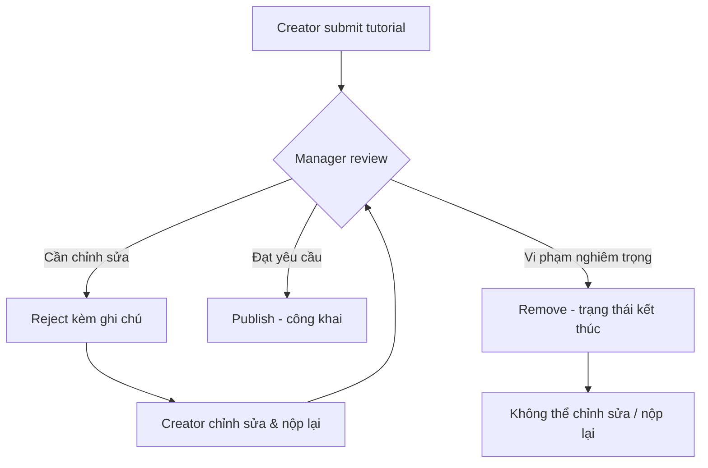
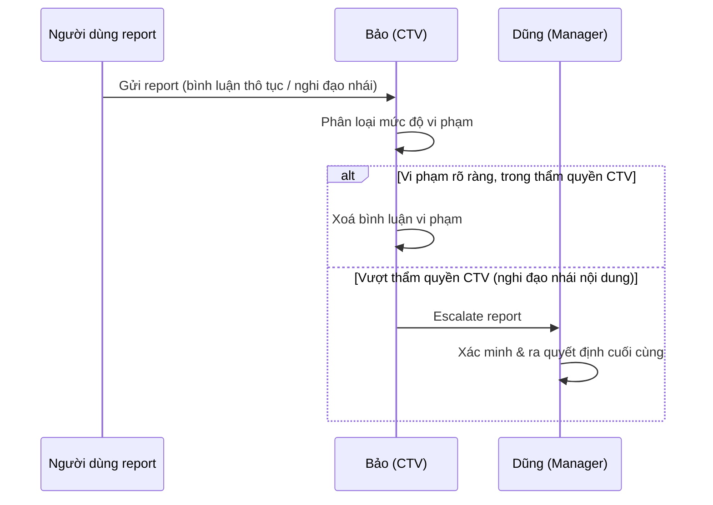
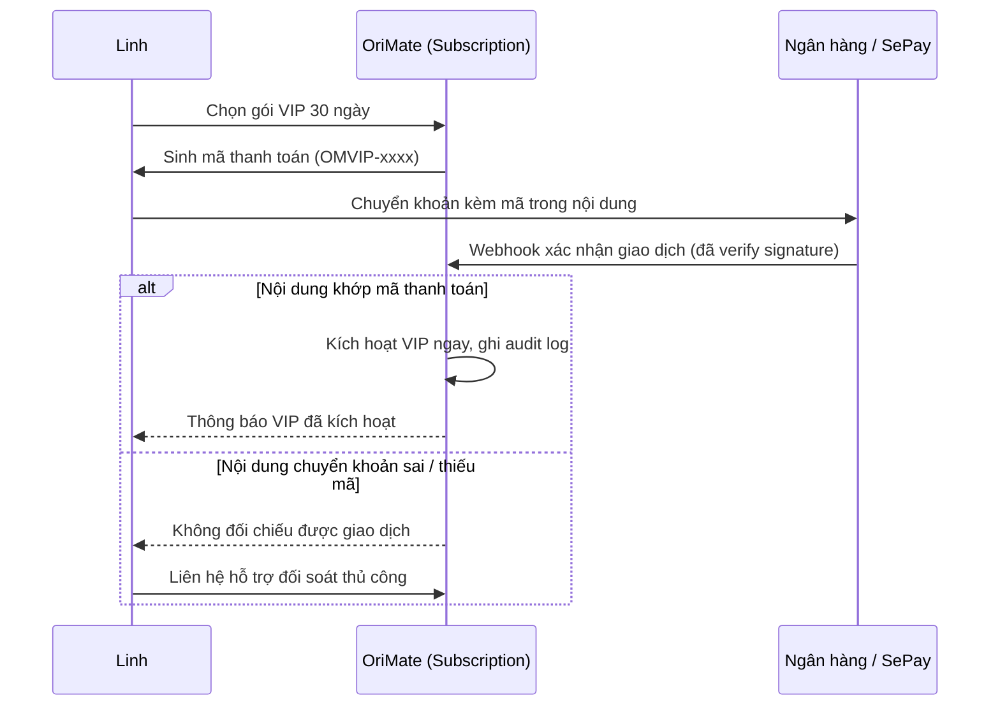
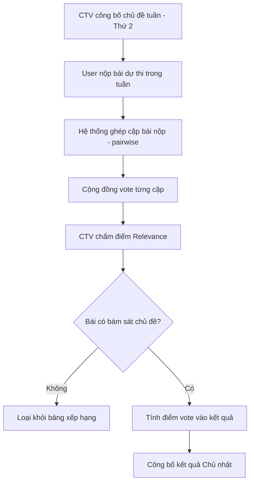

# Part 2 — Scenario / Narrative (OriMate, BRD v5.0)

> Phạm vi: toàn bộ 8 FE / 33 FT theo `FT_MAPPING_v5.md` (bao gồm cả các FT thuộc mục Could-have / Future Work trong `MVP_SCOPE.md` — tài liệu này mô tả **tầm nhìn sản phẩm đầy đủ**, không phải phạm vi code 3 tuần). Kịch bản được viết và duyệt bởi stakeholder **trước khi** Feature Description (Part 3) được soạn.

## Nhân vật xuyên suốt (Persona)

| Tên | Vai trò (actor) | Bối cảnh nền |
|---|---|---|
| **Mai** (Vũ Ngọc Mai, 19 tuổi) | Guest → User mới | Sinh viên năm nhất, biết đến OriMate qua TikTok, chưa từng gấp giấy nghiêm túc |
| **Linh** (Nguyễn Thuỳ Linh, 24 tuổi) | User | Nhân viên văn phòng, dùng app ~4 tháng, gấp giấy để thư giãn buổi tối |
| **Minh** (Trần Quốc Minh, 30 tuổi) | Creator | Giáo viên mỹ thuật, đăng tutorial origami trình độ trung cấp |
| **Dũng** (Lê Anh Dũng) | Manager | Quản lý nội dung của OriMate, duyệt tutorial và xử lý report nghiêm trọng |
| **Hà** (Phạm Thu Hà) | Admin | Quản trị hệ thống, cấu hình nền tảng |
| **Bảo** (Đỗ Gia Bảo) | Contributor Reviewer (CTV) | Tình nguyện viên cộng đồng, kiểm duyệt nhẹ + vận hành Weekly/Daily Challenge |
| **Khánh** (Hoàng Gia Khánh) | User | Trưởng một Clan |
| **Trang** (Bùi Thu Trang) | User | Thành viên cộng đồng, tương tác thường xuyên với Linh |

---

## FE-01: User Registration, Login & Platform Administration

### S1 — Mai đăng ký tài khoản lần đầu *(FT-01)*
**Bối cảnh:** 21h, Mai nằm trên giường dùng điện thoại sau khi xem video origami trên TikTok, lần đầu mở OriMate.

Mai nhập email cá nhân và mật khẩu để tạo tài khoản. Hệ thống gửi email xác thực; Mai bấm vào link ngay trong email trên điện thoại và được chuyển về app ở trạng thái đã xác thực, sẵn sàng đăng nhập lần đầu.

**Luồng ngoại lệ:** Nếu Mai gõ nhầm và dùng một email đã có người đăng ký trước đó, hệ thống báo lỗi ngay tại bước đăng ký để cô sửa lại — khác với lúc đăng nhập sai, khi đó thông báo lỗi luôn chung chung ("email hoặc mật khẩu không đúng") để tránh lộ thông tin email nào đã tồn tại trong hệ thống.

### S2 — Linh quên mật khẩu *(FT-02)*
**Bối cảnh:** 7h sáng, Linh mở laptop cá nhân trước giờ đi làm, không đăng nhập được vì đổi điện thoại gần đây và quên mật khẩu cũ.

Linh bấm "Quên mật khẩu", nhận email chứa link đặt lại, đặt mật khẩu mới trong vòng vài phút. Ngay sau khi đổi mật khẩu thành công, toàn bộ phiên đăng nhập cũ trên điện thoại và máy tính bảng của Linh bị đăng xuất, buộc cô phải đăng nhập lại bằng mật khẩu mới trên mọi thiết bị.

**Luồng ngoại lệ:** Nếu Linh bận việc và chỉ bấm vào link sau hơn 1 giờ kể từ lúc gửi, link đã hết hạn và không dùng lại được (link chỉ dùng một lần) — cô phải yêu cầu gửi lại link mới.

### S3 — Hà cập nhật cấu hình nền tảng *(FT-03)*
**Bối cảnh:** Sáng thứ Ba, Hà nhận được báo cáo từ Bảo (CTV) rằng một từ ngữ thô tục vừa lọt qua bộ lọc trong bình luận của cộng đồng.

Hà đăng nhập với vai trò Admin, thêm từ khoá đó vào danh sách từ bị chặn để nó không thể lưu được nữa trong bất kỳ bài viết, bình luận hay nhật ký nào kể từ thời điểm cập nhật. Trong cùng phiên làm việc, Hà cũng tạo thêm một danh mục (category) mới "Origami Modular" để chuẩn bị cho một đợt tutorial mới mà Minh sắp đăng.

---

## FE-02: Tutorial Publishing, Review & Guided Learning

### S4 — Minh soạn tutorial mới *(FT-04)*
**Bối cảnh:** 20h, sau giờ dạy, Minh ngồi ở nhà dùng laptop để soạn tutorial "Hạc giấy 12 bước" gồm ảnh và mô tả cho từng bước.

Minh lưu nháp nhiều lần trong lúc soạn, chỉnh sửa mô tả bước 5 vài lần vì chưa ưng ý, rồi gửi submit để chờ Dũng (Manager) duyệt.

**Luồng ngoại lệ:** Khi Minh gõ một câu mô tả có chứa từ ngữ nằm trong danh sách bị chặn (do Hà quản lý ở S3), thao tác lưu bị chặn ngay lập tức và Minh phải sửa lại câu đó trước khi có thể submit.

### S5 — Dũng duyệt tutorial *(FT-05)*
**Bối cảnh:** 9h sáng thứ Hai, Dũng mở danh sách tutorial đang chờ duyệt, trong đó có bài của Minh từ S4.

Dũng xem qua từng bước, nhận thấy ảnh ở bước 7 chụp không rõ góc gấp nên chọn Reject kèm ghi chú "cần chụp lại ảnh bước 7 rõ hơn". Minh nhận được ghi chú, chỉnh sửa và nộp lại trong ngày; lần duyệt thứ hai Dũng đồng ý và Publish, tutorial xuất hiện công khai ngay sau đó.

**Luồng ngoại lệ:** Với một tutorial khác bị phát hiện sao chép gần như nguyên vẹn ảnh của một trang origami khác, Dũng chọn Remove thay vì Reject — đây là trạng thái kết thúc (terminal), tutorial không thể chỉnh sửa và nộp lại được nữa, khác với Reject vốn cho phép tác giả sửa và gửi lại nhiều lần.

### S6 — Linh tìm và bị chặn ở tutorial VIP *(FT-06, FT-08)*
**Bối cảnh:** Giờ nghỉ trưa, Linh dùng điện thoại tìm "hạc giấy", lọc theo độ khó "Trung bình".

Tutorial của Minh (S5) hiện lên gần đầu danh sách kết quả nhờ được nhiều người học và hoàn thành gần đây, xếp hạng cao hơn các tutorial cùng chủ đề nhưng ít tương tác hơn. Tò mò, Linh bấm thử một tutorial VIP của một Creator khác; cô xem được 3 bước đầu miễn phí nhưng khi cuộn tới bước 4, nội dung bị khoá và cô được đưa sang màn hình giới thiệu gói subscription của Creator đó.

### S7 — Minh chỉnh sửa tutorial đã publish *(FT-07)*
**Bối cảnh:** Hai tuần sau khi Publish (S5), Minh nhận ra tutorial thiếu một bước quan trọng ở giữa quy trình gấp.

Minh chỉnh sửa và thêm bước mới, khiến tổng số bước tăng từ 10 lên 11. Với những learner đã hoàn thành bước 10 (bước cuối cũ) nhưng giờ nằm ngoài phạm vi hợp lệ so với cấu trúc mới, hệ thống tự động chuyển tiến độ của họ sang trạng thái archived; đồng thời Dũng nhận được cảnh báo vì thay đổi này ảnh hưởng đến các learner đang học dở.

**Luồng ngoại lệ:** Ở một lần khác, Minh muốn chuyển tutorial này từ miễn phí sang VIP để tăng doanh thu, nhưng hệ thống từ chối thao tác vì đang có learner có tiến độ hoạt động (active) trên tutorial đó — Minh chỉ có thể đổi trạng thái VIP khi không còn ai đang học dở.

### S8 — Linh học theo từng bước *(FT-09)*
**Bối cảnh:** Tối thứ Bảy, Linh ngồi ở bàn ăn, giấy origami bày sẵn, mở tutorial của Minh trên điện thoại để gấp theo.

Cô đánh dấu hoàn thành từng bước khi gấp xong, tới bước 8 thì đã khuya nên dừng lại đi ngủ. Hôm sau mở lại app, Linh thấy tiến độ vẫn dừng đúng ở bước 8 như lúc trước, tiếp tục gấp từ đó mà không phải làm lại từ đầu.

### S9 — Linh bị mắc và dùng nút "Bí rồi" *(FT-10)*
**Bối cảnh:** Vẫn buổi tối đó (S8), Linh loay hoay mãi ở bước 6 — phần gấp cánh sếu — không ra hình dạng như ảnh mẫu.

Linh mở một luồng hỏi đáp gắn với đúng bước đó thay vì phải rời khỏi tutorial để tìm kiếm ở nơi khác. Minh, vì là tác giả và thường theo dõi các thắc mắc trên bài của mình, trả lời kèm ảnh chụp lại góc gấp chi tiết hơn. Linh làm theo, gấp thành công và không cần thao tác gì thêm để đóng luồng — trạng thái mắc kẹt tự nhiên kết thúc khi cô tiếp tục bước tiếp theo.

### S10 — Minh tạo biến thể tutorial *(FT-11)*
**Bối cảnh:** Sau khi tutorial gốc (S5) được đón nhận tốt, Minh muốn làm thêm một phiên bản "Hạc giấy khổ lớn" dùng cùng bố cục các bước.

Minh tạo một biến thể gắn liền với tutorial gốc thay vì phải soạn một tutorial hoàn toàn mới từ đầu, tận dụng lại phần khung đã có và chỉ điều chỉnh những bước khác biệt về kích thước giấy.

---

## FE-03: Community Feed, Social Interaction & Content Moderation

### S11 — Trang đăng bài, bị report *(FT-12)*
**Bối cảnh:** 19h, Trang vừa hoàn thành một bông hoa sen origami, chụp ảnh và đăng lên cộng đồng ngay trên điện thoại.

Linh lướt feed thấy bài của Trang và bấm thích. Ít lâu sau, một người dùng khác nghi ngờ ảnh trong bài bị lấy từ một trang mạng khác và gửi report kèm lý do.

### S12 — Linh tương tác và nhận thông báo *(FT-13)*
**Bối cảnh:** Ngay sau S11, Linh vẫn đang xem bài của Trang.

Linh để lại bình luận khen sản phẩm, follow Trang để theo dõi các bài đăng sau này, và thêm một tutorial hoa sen cô thấy trong phần bình luận vào wishlist để làm sau. Trang, đang cầm điện thoại lướt mạng ở nhà, nhận được thông báo có người follow và có bình luận mới gần như ngay lập tức.

### S13 — Bảo xử lý report, escalate lên Dũng *(FT-14)*
**Bối cảnh:** Sáng hôm sau, Bảo (CTV) mở hàng đợi report đang chờ xử lý, trong đó có report bản quyền từ S11 và một report khác về bình luận thô tục dưới bài của Trang.

Với bình luận thô tục, Bảo xử lý trực tiếp bằng cách xoá bình luận vi phạm vì đây là vi phạm rõ ràng nằm trong thẩm quyền CTV. Với report nghi đạo nhái ảnh ở S11, Bảo nhận thấy vượt quá phạm vi mình được xử lý (cần xác minh nguồn gốc ảnh, có thể ảnh hưởng đến tài khoản Creator) nên chuyển report này lên cho Dũng (Manager) quyết định.

### S14 — Mai xem profile Creator trước khi đăng ký *(FT-15)*
**Bối cảnh:** Trước khi tạo tài khoản (trước S1), Mai bấm vào một link chia sẻ dẫn tới trang cá nhân của Minh trên mạng xã hội.

Mai xem được các tutorial nổi bật của Minh và feed hoạt động gần đây của anh mà không cần đăng nhập, việc này giúp cô có ấn tượng ban đầu tốt và quyết định tạo tài khoản ngay sau đó (dẫn tới S1).

---

## FE-04: Creator VIP Subscription, Monetisation & Shop

### S15 — Linh đăng ký VIP để học tiếp tutorial *(FT-16)*
**Bối cảnh:** Sau trải nghiệm bị chặn ở S6, tối hôm đó Linh quyết định đăng ký VIP của Creator đó để học tiếp.

Linh chọn gói 30 ngày, hệ thống sinh một mã thanh toán duy nhất gắn với giao dịch của cô. Linh chuyển khoản ngân hàng đúng nội dung chứa mã đó; chỉ vài giây sau khi ngân hàng xử lý xong, hệ thống tự động đối chiếu giao dịch và kích hoạt VIP ngay mà không cần ai xác nhận thủ công — Linh quay lại tutorial và học tiếp từ bước 4 trở đi.

**Luồng ngoại lệ:** Ở một lần thử trước đó, Linh vô tình chuyển khoản thiếu nội dung mã thanh toán; hệ thống không đối chiếu được giao dịch nào khớp nên VIP không được kích hoạt tự động, và Linh phải liên hệ hỗ trợ để được đối soát thủ công.

### S16 — Minh xem dashboard doanh thu *(FT-17)*
**Bối cảnh:** Cuối tháng, Minh mở dashboard Creator của mình trên laptop để tổng kết.

Minh xem tổng số subscriber hiện có và tổng số giao dịch đã xác nhận trong tháng, từ đó quyết định nên đầu tư thời gian làm thêm tutorial VIP nào tiếp theo dựa trên chủ đề đang thu hút nhiều subscriber nhất.

### S17 — Linh mua giấy qua shop affiliate *(FT-18)*
**Bối cảnh:** Đang gấp theo một tutorial yêu cầu loại giấy hai mặt đặc biệt mà Linh không có sẵn ở nhà.

Linh thấy link mua giấy ngay trong phần mô tả tutorial, bấm vào và được chuyển sang trang của đối tác bán giấy để đặt mua, không phải tự tìm kiếm ở nơi khác.

---

## FE-05: Personal Achievement Tracking & Journal

### S18 — Linh mở Public thành tích cá nhân *(FT-19)*
**Bối cảnh:** Sau khi hoàn thành tutorial thứ 20, Linh nhận được một achievement mới.

Thành tích này mặc định ở chế độ Private nên chỉ Linh nhìn thấy; vì muốn khoe với một nhóm bạn cũng chơi origami, cô vào phần cài đặt và tự bật chế độ Public cho riêng thành tích đó để nó hiện trên trang cá nhân.

### S19 — Linh ghi lại cột mốc cá nhân *(FT-20)*
**Bối cảnh:** Sau khi lần đầu gấp thành công một con rồng giấy phức tạp — việc này không nằm trong bất kỳ tutorial nào cô đang theo trên app.

Linh tự tạo một cột mốc cá nhân, đính kèm ảnh sản phẩm, để lưu lại khoảnh khắc này như một kỷ niệm, tách biệt với hệ thống thành tích tự động gắn theo tutorial.

### S20 — Linh viết nhật ký gấp giấy *(FT-21)*
**Bối cảnh:** Ngay sau buổi gấp giấy cuối tuần (S8, S9).

Linh viết một đoạn ngắn về cảm nhận buổi học — chỗ nào khó, chỗ nào thấy vui khi làm được — kèm ảnh sản phẩm hoàn chỉnh, lưu lại trong nhật ký cá nhân mà chỉ mình cô xem được.

---

## FE-06: Clan Membership & Weekly Challenge

### S21 — Khánh lập Clan, Linh phải rời clan cũ trước *(FT-22)*
**Bối cảnh:** Khánh muốn tập hợp một nhóm bạn cùng sở thích origami ở Hà Nội.

Khánh tạo Clan "Hạc Giấy Hà Nội" và gửi lời mời tới Linh và Trang. Trang nhận lời ngay vì chưa ở clan nào. Linh cũng muốn tham gia nhưng đang là thành viên của một clan khác — cô phải rời clan cũ trước khi có thể chấp nhận lời mời của Khánh, vì mỗi người chỉ được ở một clan tại một thời điểm.

### S22 — Weekly Challenge với pairwise vote *(FT-23)*
**Bối cảnh:** Đầu tuần, Bảo (CTV) công bố chủ đề thử thách tuần này là "Origami mùa thu".

Trong tuần, Linh và Trang cùng nộp bài dự thi. Đến cuối tuần, hệ thống ghép ngẫu nhiên các bài nộp thành từng cặp để cộng đồng bình chọn bài nào đẹp hơn trong mỗi cặp. Trước khi công bố kết quả vào Chủ nhật, Bảo chấm điểm Relevance (mức độ bám sát chủ đề) cho từng bài để loại các bài lạc đề trước khi tính điểm vote cuối cùng.

### S23 — Clan hoàn thành Quest, lên hạng League *(FT-24)*
**Bối cảnh:** Cuối tuần, clan của Khánh (từ S21) đang thi đua với các clan khác trong cùng hạng League.

Cả clan cùng nhau hoàn thành Quest tuần "20 lượt hoàn thành tutorial trong clan", cộng điểm vào League chung. Cuối tháng, tổng điểm giúp clan của Khánh được thăng lên nhóm giải cao hơn cho tháng tiếp theo.

---

## FE-07: Individual Gamification & Skill Progression

### S24 — Skill Level của Linh tự tăng *(FT-25)*
**Bối cảnh:** Sau một chuỗi hoàn thành liên tiếp các tutorial ở độ khó cao hơn trước.

Linh không chủ động làm gì để "lên cấp" — cô chỉ nhận ra khi mở trang cá nhân thấy skill level của mình đã chuyển từ "Mới bắt đầu" sang "Trung cấp", phản ánh đúng năng lực thực tế qua các tutorial đã hoàn thành.

### S25 — Linh sắp mất streak *(FT-26)*
**Bối cảnh:** Linh đã giữ chuỗi ngày học liên tục 14 ngày; hôm nay bận ôn thi nên quên mở app cả ngày.

Gần cuối ngày (giờ Việt Nam), Linh nhận được nhắc nhở rằng chuỗi ngày của mình sắp bị đứt nếu không hoàn thành ít nhất một hoạt động trước nửa đêm.

### S26 — Daily Quest reset lúc 0h *(FT-27)*
**Bối cảnh:** Ngay 00:00 giờ Việt Nam, toàn bộ nhiệm vụ ngày hôm trước của Linh được làm mới.

Sáng hôm sau mở app, Linh thấy danh sách nhiệm vụ mới của ngày, hoàn thành nhiệm vụ "hoàn thành 1 bước tutorial" trong lúc chờ xe bus để nhận phần thưởng Hạt Gấp.

### S27 — Linh dùng Hạt Gấp để bảo toàn streak *(FT-28)*
**Bối cảnh:** Tối hôm đó (tiếp nối S25), Linh vẫn chưa kịp học gì và streak sắp mất.

Linh dùng số Hạt Gấp đã tích luỹ từ các Daily Quest trước đó (S26) để đổi lấy một lượt "Streak Freeze", giữ nguyên chuỗi ngày dù hôm đó không học. Linh không thể dùng Hạt Gấp để mở khoá bất kỳ tutorial VIP nào — thứ duy nhất Hạt Gấp đổi được liên quan đến streak và paper pattern, còn VIP chỉ mở qua subscription trả phí.

### S28 — Linh tham gia Daily Challenge *(FT-34)*
**Bối cảnh:** Sáng nay Dũng (Manager) đã chọn sẵn tutorial "Thử thách hôm nay"; buổi tối Linh quyết định tham gia.

Linh nộp một ảnh sản phẩm tự do theo đúng tutorial thử thách, không bị ràng buộc phải hoàn thành theo từng bước như học bình thường. Cộng đồng thả tim bình chọn suốt cả ngày; đến cuối ngày, 3 bài nhiều tim nhất nhận thưởng. Vì Linh nộp bài, streak thử thách riêng của cô tăng thêm 1 — con số này tách biệt hoàn toàn với streak học tutorial thông thường ở S25.

### S29 — Linh nhận huy hiệu mới *(FT-35)*
**Bối cảnh:** Sau khi vừa đạt streak thử thách 7 ngày liên tiếp (nối tiếp S28) và tổng cộng đã hoàn thành 20 tutorial khó.

Linh mở app và thấy 2 huy hiệu mới đã tự động xuất hiện trên trang cá nhân — hệ thống cấp huy hiệu ngay khi các mốc trên được thoả mãn, cô không cần yêu cầu hay thao tác gì để nhận.

---

## FE-08: Personalised Discovery & Onboarding

### S30 — Mai trải qua first-run flow *(FT-29)*
**Bối cảnh:** Ngay sau khi xác thực email thành công ở S1, Mai mở app lần đầu tiên.

Trước khi vào feed chính, Mai được hỏi vài câu ngắn về trình độ hiện tại (chưa biết gì) và chủ đề cô thích (động vật, hoa). Dựa trên câu trả lời, ngay tutorial đầu tiên gợi ý cho Mai đã là một mẫu đơn giản, đúng sở thích, giúp cô không cảm thấy lạc lõng ngay từ lần mở app đầu tiên.

### S31 — Mai được nhắc quay lại app *(FT-30)*
**Bối cảnh:** 5 ngày sau S30, Mai bận việc học và chưa mở lại app, để dở một tutorial ở bước 3.

Mai nhận được một email nhắc nhở nhẹ nhàng rằng cô đang gần hoàn thành một tutorial dang dở. Tối hôm đó, Mai mở lại app từ email và tiếp tục học từ đúng chỗ đã dừng.

### S32 — Mai khám phá nội dung cá nhân hoá *(FT-31)*
**Bối cảnh:** Mai (vẫn ở vai Guest lần đầu, trước khi hoàn tất đăng ký) mở trang chủ OriMate.

Ngay trên trang chủ, Mai thấy mục Đang thịnh hành, Tiếp tục học (nếu đã có tiến độ trước đó), gợi ý "Nếp gấp tiếp theo" dựa trên lịch sử xem, và các danh mục theo chủ đề — giúp cô định hướng ngay được nên bắt đầu từ đâu mà không cần tự gõ tìm kiếm.

### S33 — Hà chuẩn bị nội dung ban đầu cho nền tảng *(FT-32)*
**Bối cảnh:** Trước ngày OriMate ra mắt công khai, chưa có Creator nào đăng ký tham gia.

Hà tự soạn và đăng khoảng 10 tutorial cơ bản, gắn cờ "Official", để nền tảng có sẵn nội dung chất lượng ngay từ đầu — tránh tình trạng người dùng đầu tiên như Mai mở app lên và thấy trống rỗng vì chưa có Creator nào đóng góp.

### S34 — Mai theo một lộ trình học có sẵn *(FT-33)*
**Bối cảnh:** Sau vài ngày dùng thử tự do (S30–S32), Mai muốn học bài bản hơn thay vì chọn tutorial ngẫu nhiên.

Hà (Admin) đã tạo sẵn lộ trình "Từ cơ bản đến sếu giấy nâng cao" gồm 5 tutorial chính thức (đã publish, dùng lại các tutorial Official từ S33) sắp xếp theo đúng thứ tự độ khó tăng dần. Mai chọn đi theo lộ trình này, hoàn thành lần lượt từng tutorial theo gợi ý thay vì tự mò mẫm chọn bài tiếp theo.

---

## Scenario List (tổng hợp)

| # | Tên kịch bản | Nhân vật chính | FT liên quan | FE | Diagram |
|---|---|---|---|---|---|
| S1 | Đăng ký tài khoản lần đầu | Mai | FT-01 | FE-01 | — |
| S2 | Quên mật khẩu | Linh | FT-02 | FE-01 | — |
| S3 | Cập nhật cấu hình nền tảng | Hà | FT-03 | FE-01 | — |
| S4 | Soạn tutorial mới | Minh | FT-04 | FE-02 | — |
| S5 | Duyệt tutorial (Publish/Reject/Remove) | Dũng | FT-05 | FE-02 | ✅ Activity |
| S6 | Tìm kiếm & bị chặn ở VIP | Linh | FT-06, FT-08 | FE-02 | — |
| S7 | Chỉnh sửa tutorial đã publish | Minh | FT-07 | FE-02 | — |
| S8 | Học theo từng bước | Linh | FT-09 | FE-02 | — |
| S9 | Dùng nút "Bí rồi" | Linh, Minh | FT-10 | FE-02 | — |
| S10 | Tạo biến thể tutorial | Minh | FT-11 | FE-02 | — |
| S11 | Đăng bài & bị report | Trang | FT-12 | FE-03 | — |
| S12 | Tương tác & nhận thông báo | Linh, Trang | FT-13 | FE-03 | — |
| S13 | Xử lý report, escalate | Bảo, Dũng | FT-14 | FE-03 | ✅ Sequence |
| S14 | Xem profile Creator (Guest) | Mai, Minh | FT-15 | FE-03 | — |
| S15 | Đăng ký VIP (SePay tự động) | Linh | FT-16 | FE-04 | ✅ Sequence |
| S16 | Xem dashboard doanh thu | Minh | FT-17 | FE-04 | — |
| S17 | Mua giấy qua shop affiliate | Linh | FT-18 | FE-04 | — |
| S18 | Mở Public thành tích | Linh | FT-19 | FE-05 | — |
| S19 | Ghi cột mốc cá nhân | Linh | FT-20 | FE-05 | — |
| S20 | Viết nhật ký gấp giấy | Linh | FT-21 | FE-05 | — |
| S21 | Lập Clan, đổi Clan | Khánh, Linh, Trang | FT-22 | FE-06 | — |
| S22 | Weekly Challenge pairwise | Bảo, Linh, Trang | FT-23 | FE-06 | ✅ Activity |
| S23 | Clan Quest & League | Khánh (clan) | FT-24 | FE-06 | — |
| S24 | Skill Level tự tăng | Linh | FT-25 | FE-07 | — |
| S25 | Sắp mất streak | Linh | FT-26 | FE-07 | — |
| S26 | Daily Quest reset 0h | Linh | FT-27 | FE-07 | — |
| S27 | Dùng Hạt Gấp giữ streak | Linh | FT-28 | FE-07 | — |
| S28 | Tham gia Daily Challenge | Linh, Dũng | FT-34 | FE-07 | — |
| S29 | Nhận huy hiệu mới | Linh | FT-35 | FE-07 | — |
| S30 | First-run flow | Mai | FT-29 | FE-08 | — |
| S31 | Nhắc quay lại app | Mai | FT-30 | FE-08 | — |
| S32 | Khám phá nội dung cá nhân hoá | Mai | FT-31 | FE-08 | — |
| S33 | Chuẩn bị nội dung ban đầu | Hà | FT-32 | FE-08 | — |
| S34 | Theo lộ trình học có sẵn | Mai, Hà | FT-33 | FE-08 | — |

**Tổng:** 34 kịch bản, phủ đủ 33 FT / 8 FE. 5 kịch bản có diagram do có nhánh rẽ hoặc tương tác nhiều hệ thống (S5, S13, S15, S22 kèm thêm ở trên).
