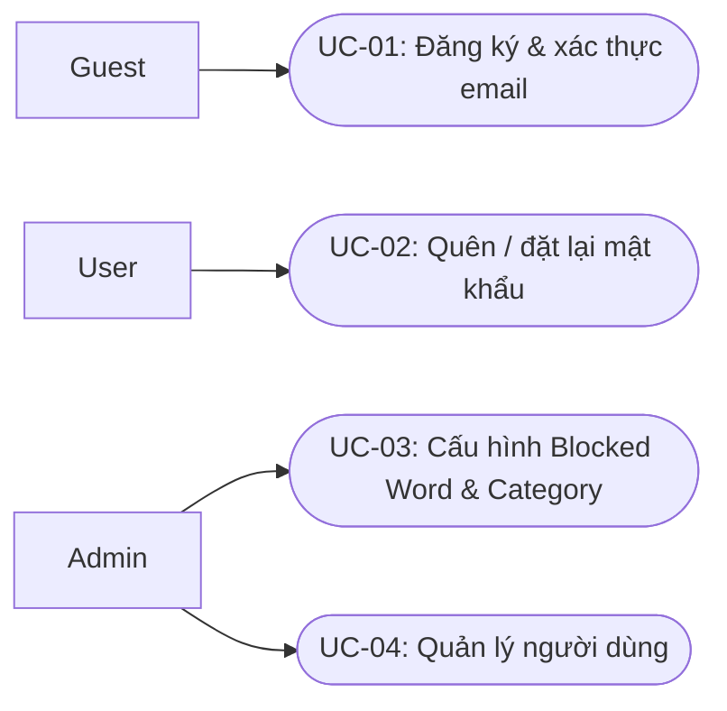
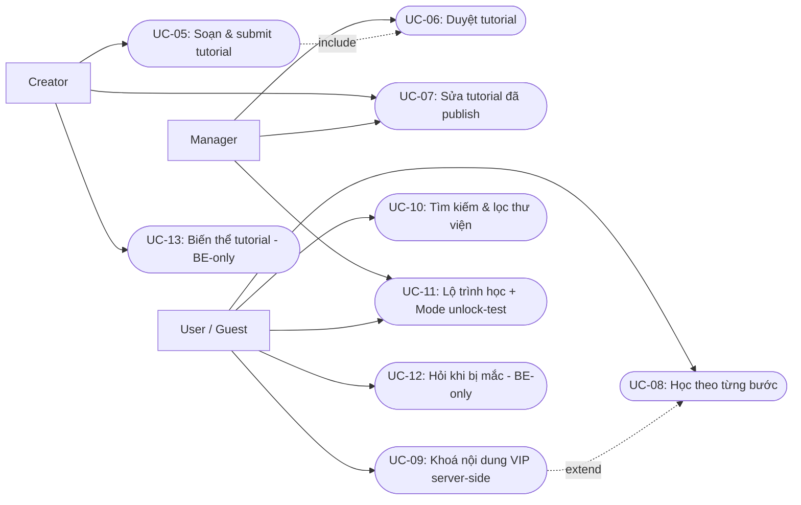
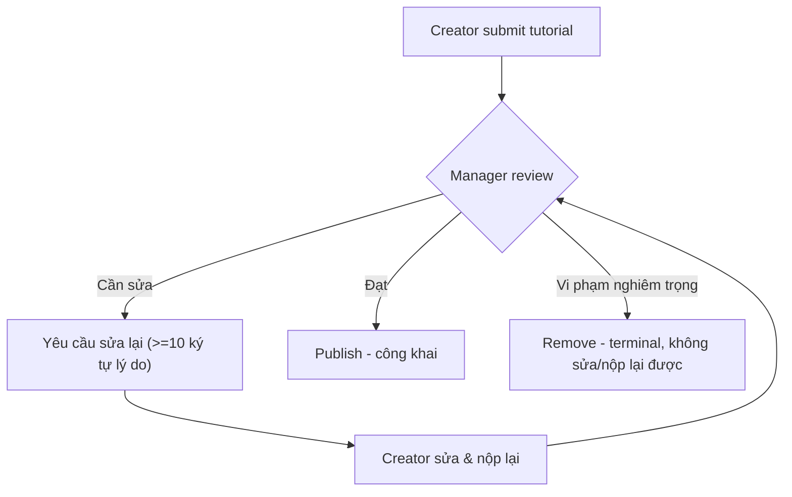
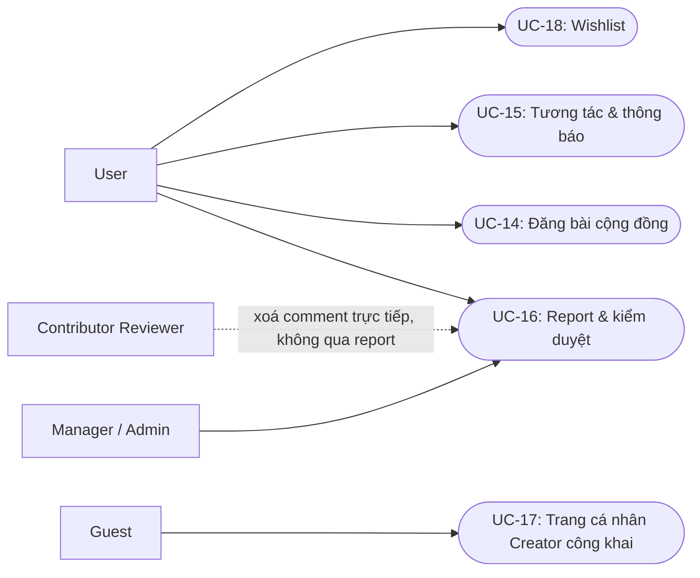
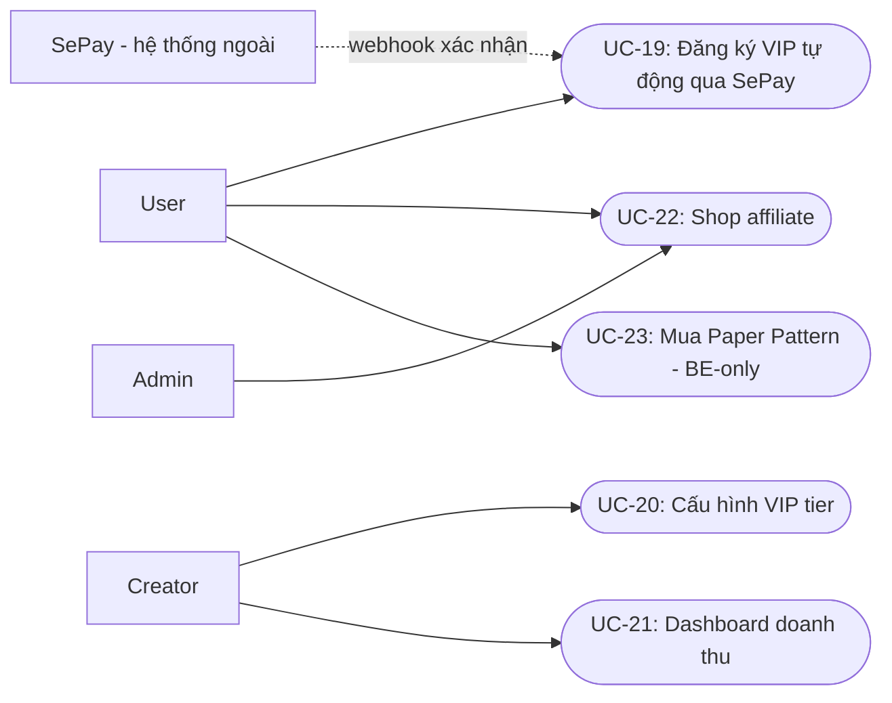
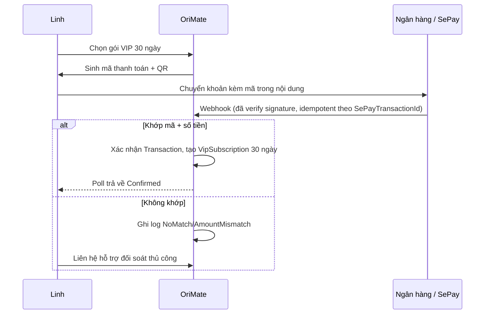
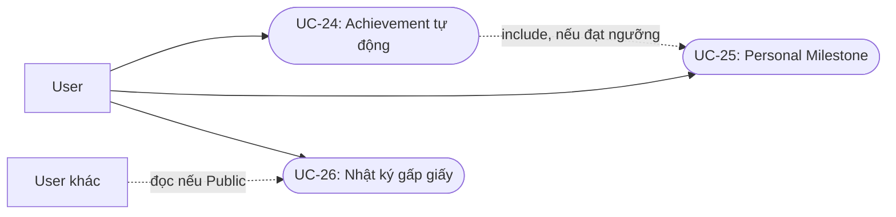
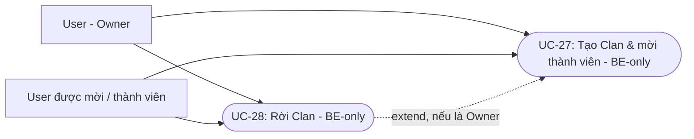
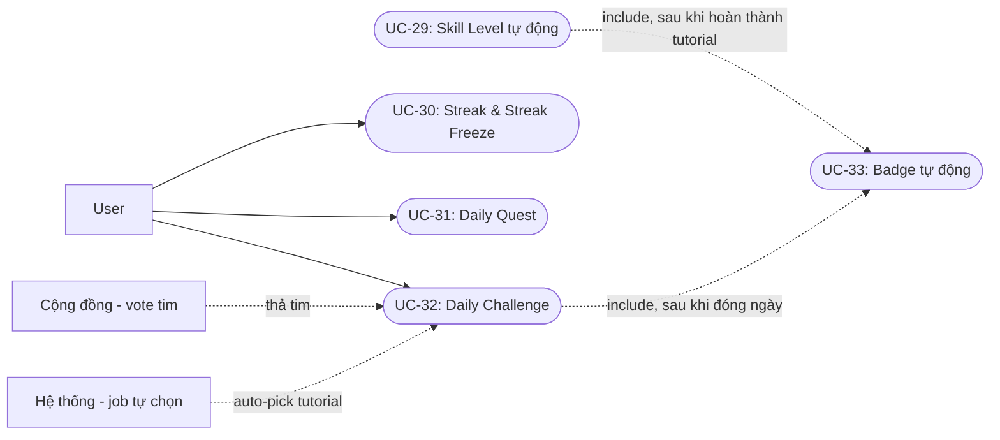
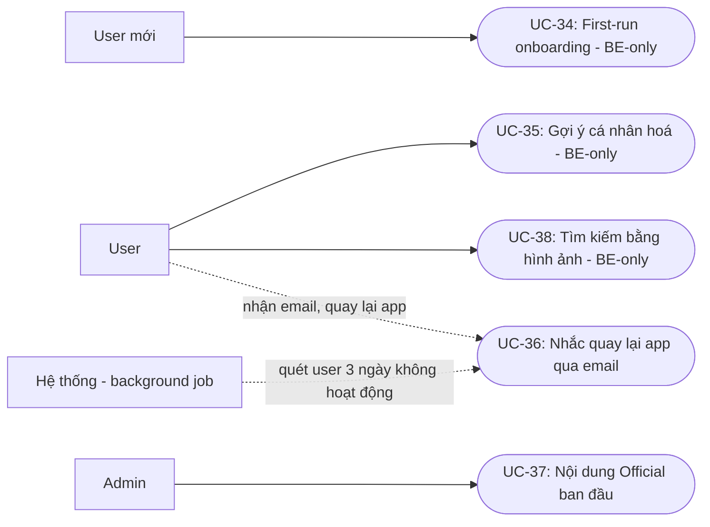

# FT / FE / Scenario — OriMate (theo trạng thái code thực tế)

> **Khác với `BRD_Part2_Scenarios.md`:** tài liệu đó mô tả tầm nhìn sản phẩm đầy đủ theo BRD v5.0 (bao gồm cả phần Won't-have). Tài liệu này được viết lại **từ đầu, không copy nội dung cũ** — mọi Feature Description (FE-xx), Functional Task (FT-xx) và Scenario (Sxx) dưới đây chỉ mô tả **những gì thực sự chạy được trong code hôm nay** (2026-08-07), xác nhận bằng cách đọc trực tiếp:
> - Backend: `OrigamiPlatform.API/Controllers/*.cs`, `OrigamiPlatform.Application/Commands|Queries/**/*.cs`, background jobs trong `Infrastructure/DependencyInjection.cs`
> - Frontend: `orimate-web/app/**/page.tsx`, `app/_components/*.tsx`, `lib/api/*.ts`
>
> **Quy tắc đối chiếu:** nếu một domain đã có giao diện ở FE (`orimate-web`) thật sự gọi API và hiển thị dữ liệu → lấy trải nghiệm FE làm gốc, đối chiếu lại BE để đảm bảo mô tả đúng business rule. Nếu FE **chưa có giao diện** cho một chức năng dù BE đã cài đầy đủ (rõ nhất là **toàn bộ Clan**, ngoài ra còn vài chức năng nhỏ khác liệt kê bên dưới) → chức năng đó được đánh dấu **"(BE-only)"** và kịch bản được viết ở mức gọi API trực tiếp, không mô tả UI vì UI chưa tồn tại.

---

## Nhân vật (Persona)

| Tên | Vai trò (actor) | Bối cảnh nền |
|---|---|---|
| **Mai** (Vũ Ngọc Mai, 19 tuổi) | Guest → User mới | Sinh viên năm nhất, lần đầu dùng OriMate |
| **Linh** (Nguyễn Thuỳ Linh, 24 tuổi) | User | Dùng app ~4 tháng, gấp giấy buổi tối để thư giãn |
| **Minh** (Trần Quốc Minh, 30 tuổi) | Creator | Đăng tutorial, có kênh riêng, cân nhắc mở VIP |
| **Dũng** (Lê Anh Dũng) | Manager | Duyệt tutorial, xử lý report |
| **Hà** (Phạm Thu Hà) | Admin | Cấu hình nền tảng, quản lý user |
| **Bảo** (Đỗ Gia Bảo) | Contributor Reviewer (CTV) | Xoá bình luận vi phạm rõ ràng — **không** xử lý hàng đợi report |
| **Khánh** (Hoàng Gia Khánh) | User | Chủ một Clan (trải nghiệm qua API, chưa có UI) |
| **Trang** (Bùi Thu Trang) | User | Tương tác cộng đồng thường xuyên với Linh |

---

## FE-01: Auth & Platform Administration

| FT | Tên | Mô tả | Trạng thái |
|---|---|---|---|
| FT-01 | Đăng ký & xác thực email | Tạo tài khoản, verify token 24h, single-use | BE ✅ · FE ✅ |
| FT-02 | Quên / đặt lại mật khẩu | Reset token 1h, đổi mật khẩu → logout mọi thiết bị | BE ✅ · FE ✅ |
| FT-03 | Cấu hình Blocked Word & Category | Admin thêm/xoá từ chặn, category — áp dụng ngay | BE ✅ · FE ✅ |
| FT-04 | Quản lý người dùng | Tìm kiếm, tạo, gán/gỡ role, suspend/activate | BE ✅ · FE ✅ |

### Use Case Diagram — FE-01

### Use Case Specification — FE-01

#### UC-01 — Đăng ký & xác thực email
| Trường | Nội dung |
|---|---|
| Actor chính | Guest |
| Điều kiện tiên quyết | Chưa có tài khoản gắn với email nhập vào |
| Luồng chính | 1. Guest nhập email + mật khẩu, gửi yêu cầu đăng ký. 2. Hệ thống kiểm tra email chưa tồn tại (không phân biệt hoa/thường), tạo tài khoản role User, sinh verify token hạn 24h. 3. Hệ thống trả access + refresh token ngay (tự động đăng nhập trong phiên hiện tại) và gửi email xác thực. 4. Guest bấm link trong email; hệ thống xác minh token còn hạn & chưa dùng, đánh dấu email đã xác thực. |
| Luồng thay thế / ngoại lệ | Email đã tồn tại → báo lỗi ngay tại bước đăng ký. Token hết hạn/đã dùng → phải yêu cầu gửi lại email xác thực. Đăng nhập ở thiết bị khác khi email chưa xác thực → bị chặn, thông báo chung chung. |
| Kết quả (Postcondition) | Tài khoản tồn tại; sau khi xác thực có thể đăng nhập không giới hạn thiết bị. |
| Business Rule | BR-AUTH-01, BR-AUTH-02 |

#### UC-02 — Quên / đặt lại mật khẩu
| Trường | Nội dung |
|---|---|
| Actor chính | User |
| Điều kiện tiên quyết | — (hệ thống không tiết lộ email có tồn tại hay không) |
| Luồng chính | 1. User nhập email, hệ thống sinh reset token hạn 1h, gửi email — phản hồi luôn chung chung dù email tồn tại hay không. 2. User bấm link, nhập mật khẩu mới. 3. Hệ thống xác minh token còn hạn & chưa dùng, cập nhật mật khẩu, đánh dấu token đã dùng (single-use). 4. Hệ thống xoá `RefreshTokenHash` hiện tại → mọi phiên đăng nhập cũ trên mọi thiết bị bị vô hiệu. |
| Luồng thay thế / ngoại lệ | Token hết hạn (>1h) hoặc dùng lại token đã dùng → thất bại, phải yêu cầu link mới. |
| Kết quả (Postcondition) | Mật khẩu mới có hiệu lực; user phải đăng nhập lại trên mọi thiết bị. |
| Business Rule | BR-AUTH-02 |

#### UC-03 — Cấu hình Blocked Word & Category
| Trường | Nội dung |
|---|---|
| Actor chính | Admin |
| Điều kiện tiên quyết | Đã đăng nhập role Admin |
| Luồng chính | 1. Admin thêm/xoá một từ vào danh sách chặn (hoặc tạo/sửa category). 2. Hệ thống lưu thay đổi, gọi reload bộ lọc trong bộ nhớ ngay lập tức (không cần restart). 3. Thay đổi có hiệu lực ở mọi endpoint ghi nội dung kể từ thời điểm đó. |
| Luồng thay thế / ngoại lệ | — |
| Kết quả (Postcondition) | Danh sách blocked word / category được cập nhật và áp dụng ngay. |
| Business Rule | BR-23 |

#### UC-04 — Quản lý người dùng
| Trường | Nội dung |
|---|---|
| Actor chính | Admin |
| Điều kiện tiên quyết | Đã đăng nhập role Admin |
| Luồng chính | 1. Admin tìm kiếm user theo email/tên. 2. Admin gán role cho user — hệ thống thay thế toàn bộ role hiện có bằng role mới (authoritative), ghi AuditLog. 3. Admin suspend/activate một tài khoản, ghi AuditLog. |
| Luồng thay thế / ngoại lệ | Không thể tự gỡ role Admin của chính mình. Không thể suspend một tài khoản đang có role Admin (kể cả người khác). |
| Kết quả (Postcondition) | Trạng thái/role của user được cập nhật, có audit trail. |
| Business Rule | — |

### S1 — Mai đăng ký tài khoản *(FT-01)*
21h, Mai lần đầu mở OriMate trên điện thoại sau khi thấy video origami trên TikTok. Mai nhập email và mật khẩu; hệ thống tạo tài khoản và **đăng nhập luôn cho Mai ngay trong phiên đó** (không phải chờ xác thực mới vào được lần đầu), đồng thời gửi email xác thực. Vài phút sau Mai bấm link trong email để tài khoản chuyển sang trạng thái đã xác thực.

**Luồng ngoại lệ:** Nếu Mai thoát ứng dụng trước khi bấm link, rồi hôm sau đăng nhập lại trên một thiết bị khác mà vẫn chưa xác thực — lần đăng nhập đó bị chặn cho tới khi email được xác thực. Nếu Mai gõ trùng một email đã tồn tại, lỗi báo ngay tại bước đăng ký; ngược lại sai email/mật khẩu lúc đăng nhập luôn nhận thông báo chung chung để không lộ email nào đã đăng ký.

### S2 — Linh quên mật khẩu *(FT-02)*
7h sáng, Linh mở laptop trước giờ làm, không đăng nhập được vì quên mật khẩu sau khi đổi điện thoại. Linh bấm "Quên mật khẩu", nhận link reset qua email, đặt mật khẩu mới. Ngay sau đó, toàn bộ refresh token cũ trên điện thoại và máy tính bảng của Linh bị vô hiệu — cô phải đăng nhập lại bằng mật khẩu mới trên mọi thiết bị.

**Luồng ngoại lệ:** Nếu Linh bấm link sau hơn 1 giờ kể từ lúc gửi, hoặc bấm lại link đã dùng một lần rồi, thao tác thất bại và cô phải yêu cầu gửi link mới.

### S3 — Hà cập nhật cấu hình nền tảng *(FT-03)*
Sáng thứ Ba, Bảo (CTV) báo với Hà rằng một từ thô tục vừa lọt qua bộ lọc trong bình luận cộng đồng. Hà đăng nhập vai Admin, thêm từ đó vào danh sách chặn — bộ lọc áp dụng ngay lập tức cho mọi bài viết/bình luận/nhật ký từ thời điểm đó, không cần khởi động lại hệ thống. Trong cùng phiên, Hà tạo thêm category "Origami Modular" chuẩn bị cho đợt tutorial mới của Minh.

### S4 — Hà quản lý tài khoản người dùng *(FT-04)*
Hà cần bổ nhiệm Dũng làm Manager. Hà tìm tài khoản của Dũng và gán role Manager — thao tác này **thay thế toàn bộ role cũ** bằng role mới (không cộng dồn). Vài ngày sau, Hà phát hiện một tài khoản đăng spam liên tục và suspend tài khoản đó ngay; hệ thống không cho phép Hà tự suspend một tài khoản Admin khác (kể cả chính mình), để tránh khoá nhầm quyền quản trị cao nhất.

---

## FE-02: Tutorial Publishing, Review & Guided Learning

| FT | Tên | Mô tả | Trạng thái |
|---|---|---|---|
| FT-05 | Soạn & submit tutorial | Draft nhiều lần, 3-30 bước, submit chờ duyệt | BE ✅ · FE ✅ |
| FT-06 | Duyệt tutorial (1 vòng, Manager) | Publish / Reject cần sửa (không terminal) / Remove (terminal) | BE ✅ · FE ✅ |
| FT-07 | Sửa tutorial đã publish | Bản nháp song song ("working copy") cần Manager duyệt lại | BE ✅ · FE ✅ |
| FT-08 | Học theo từng bước | Đánh dấu hoàn thành, lưu tiến độ liên tục | BE ✅ · FE ✅ |
| FT-09 | Khoá nội dung VIP server-side | 3 bước đầu free, từ bước 4 khoá thật ở API | BE ✅ · FE ✅ |
| FT-10 | Tìm kiếm & lọc thư viện | Theo category/độ khó/loại, sắp xếp, phân trang | BE ✅ · FE ✅ |
| FT-11 | Lộ trình học + Mode unlock-test | Learning Path nhiều bài theo thứ tự; mở mode khó hơn bằng nộp ảnh cho Admin duyệt | BE ✅ · FE ✅ |
| FT-12 | Hỏi khi bị mắc ("Bí rồi") | Mở luồng hỏi đáp gắn với đúng bước | **BE-only** |
| FT-13 | Biến thể tutorial (variant) | Gắn một tutorial khác làm biến thể của bản gốc | **BE-only** |

### Use Case Diagram — FE-02

### Use Case Specification — FE-02

#### UC-05 — Soạn & submit tutorial
| Trường | Nội dung |
|---|---|
| Actor chính | Creator |
| Điều kiện tiên quyết | Tutorial ở Draft hoặc RevisionRequired |
| Luồng chính | 1. Creator tạo/sửa draft: title 5-150 ký tự, description 20-500 ký tự, chọn category active. 2. Hệ thống kiểm tra blocked-word trên mọi field text trước khi lưu. 3. Creator thêm 3-30 bước (mỗi bước có ảnh + mô tả) và ảnh bìa. 4. Nếu đánh dấu VIP, hệ thống kiểm tra `CreatorVipSettings` đang active. 5. Creator submit → chuyển PendingManagerReview. |
| Luồng thay thế / ngoại lệ | Mô tả chứa từ bị chặn → lưu thất bại ngay. Thiếu bước/ảnh/ảnh bìa hoặc category không active → submit bị từ chối. Đánh dấu VIP nhưng chưa có VIP settings active → bị từ chối. |
| Kết quả (Postcondition) | Tutorial ở PendingManagerReview, chờ Manager duyệt. |
| Business Rule | BR-12, BR-13/BR-VIP-03, BR-23 |

#### UC-06 — Duyệt tutorial
| Trường | Nội dung |
|---|---|
| Actor chính | Manager |
| Điều kiện tiên quyết | Tutorial ở PendingManagerReview (Remove yêu cầu tutorial đang Published) |
| Luồng chính | 1. Manager mở hàng đợi, xem chi tiết tutorial. 2. Manager Publish → tutorial công khai ngay, ghi `TutorialReviewHistory` (insert-only, bất biến), thông báo tác giả. |
| Luồng thay thế / ngoại lệ | **Reject** (cần sửa): yêu cầu lý do ≥10 ký tự → về RevisionRequired (không terminal), nộp lại được nhiều lần. **Remove**: chỉ trên tutorial đã Published → Removed (terminal), không sửa/nộp lại được. |
| Kết quả (Postcondition) | Tutorial ở Published / RevisionRequired / Removed; có lịch sử duyệt bất biến. |
| Business Rule | BR-TUT-01, BR-17 |

#### UC-07 — Sửa tutorial đã publish
| Trường | Nội dung |
|---|---|
| Actor chính | Creator (tạo working copy) |
| Actor phụ | Manager (duyệt lại) |
| Điều kiện tiên quyết | Tutorial đang Published, chưa có working copy nào đang mở |
| Luồng chính | 1. Creator tạo working copy (bản sao gắn `ParentTutorialId`, trạng thái EditPendingReview) — bản gốc vẫn hiển thị bình thường. 2. Creator chỉnh sửa nội dung trên working copy. 3. Manager Approve → nội dung gộp vào bản gốc, working copy chuyển Merged (không xoá cứng). |
| Luồng thay thế / ngoại lệ | Chỉ một working copy mở tại một thời điểm. Tăng số bước → learner có tiến độ vượt cấu trúc mới bị tự động chuyển "archived", Manager nhận cảnh báo. Đổi `isVip` bị từ chối nếu có learner tiến độ active. |
| Kết quả (Postcondition) | Bản gốc phản ánh nội dung mới sau khi duyệt; tiến độ learner được điều chỉnh nếu cần. |
| Business Rule | BR-TUT-02, BR-TUT-03, BR-TUT-04 |

#### UC-08 — Học theo từng bước
| Trường | Nội dung |
|---|---|
| Actor chính | User |
| Điều kiện tiên quyết | Tutorial ở Published |
| Luồng chính | 1. User mở tutorial, xem từng bước. 2. User đánh dấu hoàn thành một bước (chỉ chấp nhận một lần/bước). 3. Khi hoàn thành bước cuối, hệ thống cộng Skill Point + Hạt Gấp theo độ khó, cập nhật streak (auto-consume freeze nếu cần) và tiến độ Daily Quest. |
| Luồng thay thế / ngoại lệ | User đóng app giữa chừng → tiến độ được lưu, mở lại tiếp tục đúng bước đã dừng. |
| Kết quả (Postcondition) | Tiến độ được lưu bền vững; nếu hoàn thành toàn bộ, các cơ chế gamification liên quan được kích hoạt. |
| Business Rule | — |

#### UC-09 — Khoá nội dung VIP server-side
| Trường | Nội dung |
|---|---|
| Actor chính | User (chưa có subscription) |
| Điều kiện tiên quyết | Tutorial `isVip = true` |
| Luồng chính | 1. User mở tutorial VIP, xem miễn phí N bước đầu (`VipFreePreviewStepCount`). 2. Từ bước vượt ngưỡng, server trả `Description=""`, `ImageUrl=null`, `IsLocked=true` — không phải chỉ ẩn ở UI. 3. User được dẫn sang màn hình đăng ký VIP (UC-19). |
| Luồng thay thế / ngoại lệ | **Gap đã ghi nhận:** endpoint hoàn thành bước không re-check subscription, nên một client biết trước `stepId` về lý thuyết vẫn gọi hoàn thành được bước đã khoá. |
| Kết quả (Postcondition) | Nội dung bước khoá chỉ hiển thị đầy đủ sau khi có subscription active. |
| Business Rule | BR-VIP-01 |

#### UC-10 — Tìm kiếm & lọc thư viện
| Trường | Nội dung |
|---|---|
| Actor chính | Guest / User |
| Luồng chính | 1. Actor nhập từ khoá và/hoặc chọn bộ lọc (category, độ khó, loại). 2. Actor chọn cách sắp xếp. 3. Hệ thống trả kết quả theo trang. |
| Luồng thay thế / ngoại lệ | Không có kết quả khớp → danh sách rỗng. |
| Kết quả (Postcondition) | Danh sách tutorial khớp điều kiện lọc/tìm kiếm. |
| Business Rule | — |

#### UC-11 — Lộ trình học + Mode unlock-test
| Trường | Nội dung |
|---|---|
| Actor chính | User |
| Actor phụ | Admin/Manager (duyệt unlock-test) |
| Điều kiện tiên quyết | User đã hoàn thành các tutorial của mode hiện tại, hoặc cần vượt bài test để mở mode kế |
| Luồng chính | 1. User học tuần tự các tutorial trong Learning Path. 2. Hoàn thành hết path đã publish trong mode hiện tại → mode kế tự mở. 3. (Nhánh khác) Mode yêu cầu bài kiểm tra ảnh: User nộp ảnh sản phẩm gấp thật (`ModeUnlockSubmission`, Pending). 4. Admin/Manager Approve/Reject. |
| Luồng thay thế / ngoại lệ | Submission bị Reject → mode vẫn khoá, User nộp lại được. |
| Kết quả (Postcondition) | Mode mới mở khoá (Approved) hoặc vẫn khoá (Pending/Rejected). |
| Business Rule | — |

#### UC-12 — Hỏi khi bị mắc ("Bí rồi") — BE-only
| Trường | Nội dung |
|---|---|
| Actor chính | User (đặt câu hỏi) |
| Actor phụ | Creator / User khác (trả lời) |
| Điều kiện tiên quyết | User đang ở một bước cụ thể trong tutorial |
| Luồng chính | *(chỉ qua API — chưa có UI)* 1. User gọi API raise-stuck-flag cho `stepId` hiện tại → tạo `StuckThread` (một cái/user/bước). 2. Người khác trả lời qua API comment gắn `TargetType.StuckThread`. 3. User tiếp tục sang bước kế — luồng mắc kẹt tự kết thúc, không cần đóng thread thủ công. |
| Luồng thay thế / ngoại lệ | Gọi raise-stuck-flag lần 2 cho cùng bước → bị chặn (đã có thread). |
| Kết quả (Postcondition) | Có một `StuckThread` lưu lịch sử hỏi-đáp gắn với bước đó. |
| Business Rule | — |

#### UC-13 — Biến thể tutorial (variant) — BE-only
| Trường | Nội dung |
|---|---|
| Actor chính | Creator (chủ tutorial gốc) |
| Điều kiện tiên quyết | Cả hai tutorial cùng thuộc sở hữu Creator |
| Luồng chính | *(chỉ qua API — Studio chưa có UI)* 1. Creator gọi API add-variant, gắn tutorial B làm biến thể của tutorial A. 2. Hệ thống chặn tự liên kết chính nó và chặn tạo trùng cặp. |
| Luồng thay thế / ngoại lệ | Gọi lại với cặp đã tồn tại → bị từ chối. |
| Kết quả (Postcondition) | Hai tutorial được liên kết là biến thể của nhau. |
| Business Rule | — |

> **Ghi chú kỹ thuật cần theo dõi:** endpoint hoàn thành bước (`complete step`) không kiểm tra lại quyền truy cập VIP ở phía ghi — chỉ luồng đọc/hiển thị (S8 dưới đây) mới trả về nội dung bị khoá. Về lý thuyết một client biết trước `stepId` của bước VIP vẫn có thể gọi hoàn thành bước đó mà không cần subscription đang active.

### S5 — Minh soạn tutorial mới *(FT-05)*
20h, sau giờ dạy, Minh dùng laptop soạn tutorial "Hạc giấy 12 bước" trong Studio, lưu nháp nhiều lần khi chỉnh mô tả từng bước. Khi đủ 3-30 bước có ảnh + mô tả và ảnh bìa, Minh submit để chờ Dũng duyệt.

**Luồng ngoại lệ:** Khi Minh gõ một câu mô tả chứa từ trong danh sách chặn (S3), thao tác lưu bị chặn ngay và Minh phải sửa lại trước khi submit được.

### S6 — Dũng duyệt tutorial *(FT-06)*
9h sáng thứ Hai, Dũng mở hàng đợi tutorial chờ duyệt, thấy bài của Minh. Ảnh bước 7 chụp không rõ nên Dũng chọn "Yêu cầu sửa lại" kèm ghi chú tối thiểu 10 ký tự; tutorial quay về trạng thái cần chỉnh sửa (không phải trạng thái kết thúc — Minh sửa và nộp lại được nhiều lần). Minh sửa trong ngày, nộp lại; lần duyệt thứ hai Dũng Publish, tutorial công khai ngay. Với một tutorial khác bị phát hiện sao chép gần như nguyên vẹn ảnh của người khác, Dũng chọn Remove — trạng thái kết thúc, tutorial không còn sửa/nộp lại được nữa.

### S7 — Minh sửa tutorial đã publish *(FT-07)*
Hai tuần sau khi publish, Minh nhận ra thiếu một bước ở giữa quy trình. Vì tutorial đã công khai, Minh không sửa trực tiếp mà tạo một **bản nháp song song** (working copy) — chỉnh sửa ở đó trong khi bản gốc vẫn hiển thị bình thường cho người học. Dũng duyệt lại bản sửa; khi được duyệt, nội dung mới được gộp vào bản gốc (bản nháp không bị xoá cứng, chỉ chuyển trạng thái "đã gộp"). Vì tổng số bước tăng từ 10 lên 11, những learner đã hoàn thành bước 10 cũ nhưng giờ nằm ngoài cấu trúc mới bị hệ thống tự động chuyển tiến độ sang "archived"; Dũng cũng nhận cảnh báo vì thay đổi ảnh hưởng learner đang học dở.

**Luồng ngoại lệ:** Minh muốn đổi tutorial từ free sang VIP, nhưng hệ thống từ chối vì đang có learner có tiến độ hoạt động (active) — chỉ đổi được khi không còn ai học dở.

### S8 — Linh học theo bước & gặp khoá VIP *(FT-08, FT-09)*
Tối thứ Bảy, Linh mở tutorial của Minh trên điện thoại, đánh dấu hoàn thành từng bước; tới bước 8 thì dừng đi ngủ, hôm sau mở lại thấy tiến độ vẫn đúng ở bước 8. Một lần khác, Linh tò mò mở một tutorial VIP của Creator khác: xem miễn phí 3 bước đầu, nhưng tới bước 4 nội dung (mô tả, ảnh) thực sự không được server trả về — không phải chỉ ẩn ở giao diện — và Linh được dẫn sang màn hình đăng ký VIP.

### S9 — Linh tìm kiếm tutorial *(FT-10)*
Giờ nghỉ trưa, Linh dùng điện thoại tìm "hạc giấy", lọc theo độ khó "Trung bình", sắp xếp theo lượt thích. Tutorial của Minh hiện gần đầu danh sách.

### S10 — Mai theo lộ trình học có mode nâng cao *(FT-11)*
Sau vài ngày dùng thử, Mai muốn học bài bản nên chọn lộ trình "Từ cơ bản đến sếu giấy nâng cao" — một chuỗi tutorial theo đúng thứ tự độ khó tăng dần, được nhóm theo "mode". Khi hoàn thành hết mode hiện tại, Mai muốn mở mode khó hơn: cô hoàn thành một lộ trình đã publish trong mode hiện tại (đủ điều kiện tự động), hoặc — với một mode khác yêu cầu "bài kiểm tra ảnh" — Mai nộp ảnh sản phẩm gấp thật, Admin/Manager xét duyệt Approve/Reject trước khi mode mới thực sự mở khoá.

### S11 — Linh bị mắc và hỏi ở đúng bước *(FT-12, BE-only)*
Linh loay hoay ở bước 6 nhưng **chưa có nút hoặc màn hình nào trên app** để mở luồng hỏi đáp gắn với bước đó — chức năng chỉ tồn tại ở API (`raise stuck flag` tạo một `StuckThread` một-lần-mỗi-bước-mỗi-user, trả lời qua cơ chế comment dùng chung). Minh thoạt tiên chỉ có thể trả lời nếu có công cụ gọi API trực tiếp (ví dụ Postman) — người dùng thường trên app hiện không thấy tính năng này.

### S12 — Minh tạo biến thể tutorial *(FT-13, BE-only)*
Minh muốn làm thêm bản "Hạc giấy khổ lớn" gắn với tutorial gốc, nhưng Studio **chưa có màn hình** để liên kết biến thể — BE đã có endpoint (chặn tự liên kết chính nó, chặn tạo trùng cặp) nhưng chưa được FE gọi tới.

---

## FE-03: Community Feed & Moderation

| FT | Tên | Mô tả | Trạng thái |
|---|---|---|---|
| FT-14 | Đăng bài cộng đồng | Nội dung + tối đa 10 media, qua blocked-word | BE ✅ · FE ✅ |
| FT-15 | Tương tác & thông báo | Like, comment, follow, notification | BE ✅ · FE ✅ |
| FT-16 | Report & kiểm duyệt | Report vào hàng đợi (Manager/Admin xử lý); CTV xoá comment vi phạm rõ ràng trực tiếp | BE ✅ · FE ✅ |
| FT-17 | Trang cá nhân Creator công khai | Xem được cả khi chưa đăng nhập (Guest) | BE ✅ · FE ✅ |
| FT-18 | Wishlist | Lưu tutorial để học sau | BE ✅ · FE ✅ |

### Use Case Diagram — FE-03

### Use Case Specification — FE-03

#### UC-14 — Đăng bài cộng đồng
| Trường | Nội dung |
|---|---|
| Actor chính | User |
| Luồng chính | 1. User nhập nội dung (1-1000 ký tự) + tối đa 10 media. 2. Hệ thống kiểm tra blocked-word trước khi lưu. 3. Bài đăng hiển thị trên feed. |
| Luồng thay thế / ngoại lệ | Nội dung chứa từ bị chặn hoặc vượt giới hạn media → từ chối lưu. |
| Kết quả (Postcondition) | Bài đăng công khai trên feed. |
| Business Rule | BR-23 |

#### UC-15 — Tương tác & thông báo
| Trường | Nội dung |
|---|---|
| Actor chính | User |
| Luồng chính | 1. User like/comment (1-500 ký tự, qua blocked-word)/follow một user khác. 2. Hệ thống ghi nhận, gửi notification tới chủ nội dung/người được follow (best-effort, không chặn luồng chính nếu gửi thất bại). |
| Luồng thay thế / ngoại lệ | Tự follow chính mình → bị chặn. |
| Kết quả (Postcondition) | Notification xuất hiện trong hộp thư người nhận. |
| Business Rule | BR-23 |

#### UC-16 — Report & kiểm duyệt
| Trường | Nội dung |
|---|---|
| Actor chính | User (gửi report), Manager/Admin (xử lý report) |
| Actor phụ | Contributor Reviewer (chỉ xoá comment trực tiếp, tách biệt hàng đợi report) |
| Luồng chính (report queue) | 1. User gửi report một nội dung kèm lý do (một report/user/target). 2. Manager/Admin mở hàng đợi, xem chi tiết. 3. Manager/Admin chọn Dismiss / RemoveContent (ẩn mềm, `IsDeleted=true`) / SuspendAccount. 4. Hệ thống ghi AuditLog cho mọi hành động. |
| Luồng song song (CTV) | 1. CTV thấy một comment vi phạm rõ ràng. 2. CTV xoá trực tiếp, nhập lý do ≥10 ký tự — không đi qua hàng đợi report, CTV không thấy được hàng đợi này. |
| Luồng thay thế / ngoại lệ | SuspendAccount không áp dụng được lên một tài khoản đang có role Admin. |
| Kết quả (Postcondition) | Nội dung vi phạm bị ẩn/xoá, hoặc report bị dismiss; có audit trail. |
| Business Rule | — |

#### UC-17 — Trang cá nhân Creator công khai
| Trường | Nội dung |
|---|---|
| Actor chính | Guest / User |
| Luồng chính | 1. Actor mở link trang cá nhân Creator (không cần đăng nhập). 2. Hệ thống trả tutorial nổi bật, hoạt động gần đây, follower/following/achievement count, `IsFollowing` (nếu đã đăng nhập). |
| Kết quả (Postcondition) | Actor xem được hồ sơ công khai của Creator. |
| Business Rule | — |

#### UC-18 — Wishlist
| Trường | Nội dung |
|---|---|
| Actor chính | User |
| Luồng chính | 1. User bấm lưu một tutorial vào wishlist. 2. Tutorial xuất hiện trong danh sách wishlist cá nhân để xem lại sau. |
| Kết quả (Postcondition) | Tutorial được lưu trong wishlist của user. |
| Business Rule | — |

> **Đính chính so với BRD cũ:** CTV **không** xử lý hàng đợi report (`SubmitReport`/`HandleReport` chỉ dành cho Manager/Admin) — CTV chỉ có quyền xoá trực tiếp một comment vi phạm rõ ràng (endpoint riêng, không đi qua report), nên không có bước "CTV escalate report lên Manager" trong thực tế.

### S13 — Trang đăng bài, bị report *(FT-14, FT-16)*
19h, Trang vừa gấp xong một bông hoa sen, chụp ảnh đăng lên cộng đồng ngay trên điện thoại. Linh lướt feed và bấm thích. Ít lâu sau, một người dùng khác nghi ảnh bị lấy từ nơi khác và gửi report kèm lý do — report vào thẳng hàng đợi của Dũng (Manager), không qua CTV. Dũng xác minh và chọn Dismiss (report không có cơ sở) hoặc RemoveContent (ẩn bài, không xoá cứng).

### S14 — Linh tương tác và nhận thông báo *(FT-15)*
Ngay sau S13, Linh bình luận khen sản phẩm, follow Trang, và lưu một tutorial hoa sen thấy trong bình luận vào wishlist. Trang, đang cầm điện thoại ở nhà, nhận thông báo có người follow và bình luận mới gần như ngay lập tức.

### S15 — Bảo xoá bình luận vi phạm rõ ràng *(FT-16)*
Sáng hôm sau, dưới một bài khác, Bảo (CTV) thấy một bình luận chứa lời lẽ thô tục rõ ràng. Vì đây là vi phạm nằm trong thẩm quyền CTV, Bảo xoá trực tiếp bình luận đó kèm lý do (tối thiểu 10 ký tự) — thao tác này tách biệt hoàn toàn với hàng đợi report mà chỉ Dũng và Hà xử lý; Bảo không có quyền và không thấy hàng đợi report trong tài khoản của mình.

### S16 — Mai xem profile Creator trước khi đăng ký *(FT-17)*
Trước khi tạo tài khoản (trước S1), Mai bấm vào link chia sẻ dẫn tới trang cá nhân của Minh. Mai xem được tutorial nổi bật và hoạt động gần đây của Minh mà không cần đăng nhập, ấn tượng tốt khiến cô quyết định đăng ký ngay sau đó.

### S17 — Linh lưu tutorial vào wishlist *(FT-18)*
Đang lướt thư viện, Linh thấy một tutorial hay nhưng chưa có thời gian học ngay, cô bấm lưu vào wishlist để làm sau thay vì phải nhớ tên và tìm lại.

---

## FE-04: VIP Subscription, Payment & Shop

| FT | Tên | Mô tả | Trạng thái |
|---|---|---|---|
| FT-19 | Đăng ký VIP tự động (SePay) | QR + polling, webhook xác nhận tự động, verify signature, chống trùng | BE ✅ · FE ✅ |
| FT-20 | Cấu hình VIP tier của Creator | Cần ≥5 tutorial published, giá cố định nền tảng | BE ✅ · FE ✅ |
| FT-21 | Dashboard doanh thu Creator | Subscriber, doanh thu tháng/tổng | BE ✅ · FE ✅ |
| FT-22 | Shop affiliate (mua giấy ngoài) | Link ra trang đối tác, Admin quản lý danh sách | BE ✅ · FE ✅ |
| FT-23 | Mua Paper Pattern bằng Hạt Gấp | Trừ Hạt Gấp, chặn mua trùng | **BE-only** |

### Use Case Diagram — FE-04

### Use Case Specification — FE-04

#### UC-19 — Đăng ký VIP tự động qua SePay
| Trường | Nội dung |
|---|---|
| Actor chính | User |
| Actor phụ | SePay (hệ thống ngoài, qua webhook) |
| Điều kiện tiên quyết | Creator có `CreatorVipSettings.IsActive = true`; User chưa có subscription active với Creator đó |
| Luồng chính | 1. User chọn gói VIP 30 ngày cho một Creator. 2. Hệ thống tạo Transaction (PendingConfirmation) với PaymentCode tự sinh (`OMVIP` + GUID), trả QR chuyển khoản. 3. User chuyển khoản đúng nội dung chứa mã. 4. SePay gửi webhook — hệ thống verify chữ ký (constant-time compare) trước khi xử lý. 5. Hệ thống khớp PaymentCode (field `code` hoặc regex trong nội dung chuyển khoản) + đối chiếu số tiền. 6. Khớp đúng → xác nhận Transaction, tạo VipSubscription 30 ngày, ghi `SePayWebhookLog` (Matched). |
| Luồng thay thế / ngoại lệ | Không khớp mã/số tiền → ghi log NoMatch/AmountMismatch, VIP không kích hoạt, User phải liên hệ hỗ trợ. Webhook trùng lặp → idempotent theo `SePayTransactionId` (AlreadyProcessed). Đã có subscription active với Creator đó → không tạo Transaction mới được. |
| Kết quả (Postcondition) | VIP subscription active 30 ngày (thành công) hoặc Transaction vẫn Pending (thất bại, cần đối soát thủ công). |
| Business Rule | BR-PAYMENT-01, BR-VIP-02, BR-VIP-03 |

#### UC-20 — Cấu hình VIP tier của Creator
| Trường | Nội dung |
|---|---|
| Actor chính | Creator |
| Điều kiện tiên quyết | Creator có ≥5 tutorial Published |
| Luồng chính | 1. Creator bật bán VIP. 2. Hệ thống áp giá cố định nền tảng (Creator không tự đặt giá). |
| Luồng thay thế / ngoại lệ | Chưa đủ 5 tutorial Published → bị từ chối bật. |
| Kết quả (Postcondition) | `CreatorVipSettings.IsActive = true`, các tutorial VIP của Creator có thể bán. |
| Business Rule | BR-VIP-06 (MinPublishedTutorialsToSell) |

#### UC-21 — Dashboard doanh thu Creator
| Trường | Nội dung |
|---|---|
| Actor chính | Creator |
| Luồng chính | 1. Creator mở dashboard doanh thu của chính mình. 2. Hệ thống trả subscriber active/pending count, doanh thu tháng này + tổng đã xác nhận, danh sách subscriber. |
| Luồng thay thế / ngoại lệ | Không xem được dashboard của Creator khác (chặn ở tầng authorization). |
| Kết quả (Postcondition) | Creator có số liệu doanh thu cập nhật. |
| Business Rule | — |

#### UC-22 — Shop affiliate (mua giấy ngoài)
| Trường | Nội dung |
|---|---|
| Actor chính | User |
| Actor phụ | Admin (quản lý link) |
| Luồng chính | 1. Admin tạo/sửa link affiliate gắn category. 2. User duyệt Shop hoặc thấy link trong mô tả tutorial, bấm vào. 3. Hệ thống chuyển hướng User sang trang đối tác ngoài. |
| Kết quả (Postcondition) | User rời app tới trang bán giấy của đối tác; không ghi nhận giao dịch nào trong OriMate. |
| Business Rule | BR-SEEDS-01 (Hạt Gấp không dùng ở đây) |

#### UC-23 — Mua Paper Pattern bằng Hạt Gấp — BE-only
| Trường | Nội dung |
|---|---|
| Actor chính | User |
| Điều kiện tiên quyết | User có đủ Hạt Gấp, chưa mua pattern đó trước đây |
| Luồng chính | *(chỉ qua API — Shop UI chưa có mục này)* 1. User gọi API mua pattern. 2. Hệ thống trừ Hạt Gấp, ghi nhận sở hữu pattern. |
| Luồng thay thế / ngoại lệ | Mua trùng pattern đã sở hữu → bị từ chối. Không đủ Hạt Gấp → bị từ chối. |
| Kết quả (Postcondition) | User sở hữu pattern, số dư Hạt Gấp giảm tương ứng. |
| Business Rule | BR-SEEDS-01 |

> **Lưu ý code cần dọn:** trang kênh Creator công khai (`CreatorChannelPage`) vẫn còn một ô nhập "Mã tham chiếu" gọi API đăng ký VIP theo kiểu thủ công cũ — API đó hiện chỉ nhận `(token, creatorId)`, không còn nhận mã tham chiếu, nên luồng này trên thực tế không hoạt động đúng. Luồng đúng và đang chạy thật là màn hình `/huong-dan/[id]/vip` (S18 bên dưới).

### S18 — Linh đăng ký VIP tự động qua SePay *(FT-19)*
Linh chọn gói VIP 30 ngày cho một Creator; hệ thống sinh mã thanh toán riêng (tiền tố `OMVIP`) và hiển thị QR chuyển khoản. Linh chuyển khoản đúng nội dung chứa mã; trang tự động polling mỗi 4 giây. Vài giây sau khi ngân hàng xử lý xong, webhook SePay (đã verify chữ ký) khớp đúng mã và số tiền, hệ thống tự kích hoạt VIP — không ai xác nhận thủ công — Linh học tiếp từ bước 4.

**Luồng ngoại lệ:** Nếu Linh chuyển khoản thiếu/sai nội dung mã, webhook không khớp được giao dịch nào (được ghi log `NoMatch`/`AmountMismatch` để audit), VIP không tự kích hoạt và Linh phải liên hệ hỗ trợ đối soát thủ công.

### S19 — Minh bật VIP tier *(FT-20)*
Sau khi đã có 5 tutorial published, Minh vào Studio bật bán VIP — giá cố định do nền tảng quy định, Minh chỉ được bật/tắt trạng thái bán, không tự đặt giá.

### S20 — Minh xem dashboard doanh thu *(FT-21)*
Cuối tháng, Minh xem tổng subscriber đang active và doanh thu đã xác nhận trong tháng trên dashboard riêng của mình — không xem được dashboard của Creator khác.

### S21 — Linh mua giấy qua shop affiliate *(FT-22)*
Đang gấp theo một tutorial cần loại giấy đặc biệt, Linh thấy link mua giấy ngay trong mô tả tutorial hoặc trong Shop, bấm vào và được chuyển sang trang đối tác bán giấy.

### S22 — Linh mua Paper Pattern bằng Hạt Gấp *(FT-23, BE-only)*
Trang Shop trên app hiện chỉ có các link affiliate dẫn ra ngoài, **không có nơi nào để tiêu Hạt Gấp**. Nhưng BE đã có sẵn endpoint mua "Paper Pattern" trừ thẳng Hạt Gấp và chặn mua trùng — chỉ kiểm thử được qua gọi API trực tiếp ở thời điểm hiện tại.

---

## FE-05: Personal Achievement & Journal

| FT | Tên | Mô tả | Trạng thái |
|---|---|---|---|
| FT-24 | Achievement tự động | Sinh khi hoàn thành tutorial, có thể bật/tắt Public | BE ✅ · FE ✅ |
| FT-25 | Personal Milestone | Mốc cá nhân tự tạo, thưởng Hạt Gấp khi đạt ngưỡng | BE ✅ · FE ✅ |
| FT-26 | Nhật ký gấp giấy (Journal) | Viết, gắn tutorial, public/private, xem journal người khác nếu public | BE ✅ · FE ✅ |

### Use Case Diagram — FE-05

### Use Case Specification — FE-05

#### UC-24 — Achievement tự động
| Trường | Nội dung |
|---|---|
| Actor chính | User |
| Điều kiện tiên quyết | Tutorial liên quan đã Published, user hoàn thành toàn bộ tutorial, chưa có achievement cho tutorial đó |
| Luồng chính | 1. User hoàn thành tutorial (UC-08). 2. Hệ thống tự tạo Achievement, `IsPublic` theo cờ client gửi lên (**xem ghi chú lệch BR** — FE hiện gửi `true`). 3. Hệ thống cascade: kiểm tra Personal Milestone theo ngưỡng, thưởng hoàn thành Learning Path (nếu là tutorial cuối), cấp badge liên quan. 4. User có thể bật/tắt Public bất kỳ lúc nào sau đó. |
| Luồng thay thế / ngoại lệ | Achievement đã tồn tại cho cặp user/tutorial → không tạo trùng. |
| Kết quả (Postcondition) | Achievement tồn tại, hiển thị public hoặc chỉ user thấy tuỳ cờ. |
| Business Rule | BR-PORTFOLIO-01 (⚠ hiện lệch ở FE — xem Phụ lục mục 6) |

#### UC-25 — Personal Milestone
| Trường | Nội dung |
|---|---|
| Actor chính | User |
| Luồng chính | 1. User tự tạo một mốc cá nhân (không gắn tutorial nào), đính ảnh. 2. Nếu mốc chạm ngưỡng đã cấu hình, hệ thống thưởng Hạt Gấp + gửi notification. |
| Kết quả (Postcondition) | Milestone được lưu trong hồ sơ, tách biệt với achievement tự động. |
| Business Rule | — |

#### UC-26 — Nhật ký gấp giấy (Journal)
| Trường | Nội dung |
|---|---|
| Actor chính | User (viết) |
| Actor phụ | User khác (đọc nếu Public) |
| Luồng chính | 1. User viết journal, tuỳ chọn gắn tutorial (phải Published), chọn Public/Private. 2. Nội dung qua blocked-word check trước khi lưu. 3. Nếu Public, user khác (kể cả không follow) xem được qua trang nhật ký công khai của tác giả. |
| Luồng thay thế / ngoại lệ | Nội dung chứa từ bị chặn → lưu thất bại. |
| Kết quả (Postcondition) | Journal được lưu, hiển thị theo đúng cờ Public/Private. |
| Business Rule | BR-23 |

> **Sai lệch so với BR-PORTFOLIO-01 ("Achievement mặc định Private"):** cả màn hình tạo achievement thủ công lẫn modal tạo achievement khi hoàn thành tutorial trên FE đều để checkbox "Public" **mặc định là bật (true)**, không phải Private như quy tắc nghiệp vụ ghi trong `CLAUDE.md`. Đây là điểm lệch giữa UI và business rule, không phải giữa hai tài liệu — cần Product/Dev xác nhận lại hành vi đúng.

### S23 — Linh nhận achievement, bật Public *(FT-24)*
Sau khi hoàn thành tutorial thứ 20, Linh nhận achievement mới. Vì muốn khoe với nhóm bạn cũng chơi origami, Linh vào phần cài đặt để hiển thị công khai trên trang cá nhân (lưu ý: theo hành vi FE hiện tại, ô Public đã được tick sẵn khi tạo — xem ghi chú lệch BR ở trên).

### S24 — Linh ghi cột mốc cá nhân *(FT-25)*
Sau khi lần đầu tự gấp thành công một con rồng giấy phức tạp — không nằm trong tutorial nào Linh đang theo — cô tạo một Personal Milestone riêng, đính ảnh sản phẩm, tách biệt với hệ thống achievement tự động gắn theo tutorial.

### S25 — Linh viết nhật ký, Trang xem lại *(FT-26)*
Sau buổi gấp giấy cuối tuần, Linh viết một đoạn ngắn về cảm nhận buổi học kèm ảnh sản phẩm, để chế độ Private. Một lần khác Linh viết nhật ký và để Public; Trang, vốn follow Linh, vào trang cá nhân của Linh và đọc được đúng những nhật ký được đánh dấu công khai đó.

---

## FE-06: Clan (Backend-only — FE chưa có giao diện)

| FT | Tên | Mô tả | Trạng thái |
|---|---|---|---|
| FT-27 | Tạo Clan & mời thành viên | 1 user chỉ ở 1 Clan tại 1 thời điểm; lời mời hết hạn sau 48h | **BE-only** |
| FT-28 | Rời Clan | Owner phải chuyển quyền Owner trước khi rời | **BE-only** |

### Use Case Diagram — FE-06 (BE-only)

### Use Case Specification — FE-06

#### UC-27 — Tạo Clan & mời thành viên — BE-only
| Trường | Nội dung |
|---|---|
| Actor chính | User (Owner tạo Clan) |
| Actor phụ | User được mời |
| Điều kiện tiên quyết | User tạo Clan chưa ở Clan nào khác |
| Luồng chính | *(chỉ qua API — chưa có UI)* 1. User gọi API tạo Clan → trở thành Owner. 2. Owner mời một user khác (lời mời hết hạn sau 48h nếu không phản hồi). 3. User được mời chấp nhận → gia nhập Clan. |
| Luồng thay thế / ngoại lệ | User được mời đang ở Clan khác → chấp nhận bị từ chối cho tới khi rời Clan cũ trước (BR-CLAN-01). |
| Kết quả (Postcondition) | Danh sách thành viên Clan cập nhật; mỗi user chỉ thuộc đúng 1 Clan. |
| Business Rule | BR-CLAN-01 |

#### UC-28 — Rời Clan — BE-only
| Trường | Nội dung |
|---|---|
| Actor chính | User (thành viên hoặc Owner) |
| Luồng chính | 1. Thành viên thường gọi API rời Clan → rời ngay. 2. Owner gọi API chuyển quyền Owner cho thành viên khác trước. 3. Sau khi không còn là Owner, user rời Clan bình thường. |
| Luồng thay thế / ngoại lệ | Owner gọi API rời Clan trực tiếp (chưa chuyển quyền) → bị từ chối. |
| Kết quả (Postcondition) | User không còn trong Clan; nếu từng là Owner, quyền đã được chuyển giao trước đó. |
| Business Rule | BR-CLAN-03 |

> `orimate-web` không có bất kỳ route, component hay API client nào nhắc tới "clan" — toàn bộ domain này hiện chỉ tồn tại ở backend (`ClanController`). Kịch bản dưới đây mô tả đúng hành vi API, viết ở góc nhìn "nếu có một client gọi API" chứ không mô tả màn hình cụ thể vì chưa có màn hình nào. Đúng như `MVP_SCOPE.md`/`CLAUDE.md`, các phần "Weekly Challenge pairwise-vote" và "Clan Quest & League" gắn với Clan trong BRD cũ **hoàn toàn không tồn tại trong code** (không entity, không handler) — không đưa vào tài liệu này.

### S26 — Khánh lập Clan, Linh phải rời clan cũ trước *(FT-27)*
Khánh gọi API tạo Clan "Hạc Giấy Hà Nội" rồi mời Linh và Trang qua API mời thành viên (lời mời tự hết hạn sau 48h nếu không được chấp nhận). Trang chấp nhận ngay vì chưa ở clan nào. Linh cũng muốn tham gia nhưng đang là thành viên clan khác — hệ thống từ chối chấp nhận lời mời cho tới khi Linh rời clan cũ trước, vì mỗi người chỉ ở một clan tại một thời điểm.

### S27 — Khánh chuyển quyền Owner trước khi rời *(FT-28)*
Khánh muốn rời clan mình lập ra, nhưng hệ thống từ chối thao tác "rời clan" trực tiếp vì Khánh đang là Owner. Khánh phải gọi API chuyển quyền Owner cho Trang trước; sau khi Trang trở thành Owner mới, Khánh mới rời clan được.

---

## FE-07: Individual Gamification

| FT | Tên | Mô tả | Trạng thái |
|---|---|---|---|
| FT-29 | Skill Level tự động | Tăng theo tutorial đã hoàn thành, không thao tác thủ công | BE ✅ · FE ✅ |
| FT-30 | Streak & Streak Freeze | Chuỗi ngày học liên tục; mua Freeze bằng Hạt Gấp (giữ tối đa 2) | BE ✅ · FE ✅ |
| FT-31 | Daily Quest | Nhiệm vụ theo ngày, thưởng Hạt Gấp, nhân hệ số streak, x1.5 Chủ nhật | BE ✅ · FE ✅ |
| FT-32 | Daily Challenge | Hệ thống tự chọn tutorial mỗi ngày, nộp ảnh tự do, vote tim, top 3 thưởng | BE ✅ · FE ✅ |
| FT-33 | Badge tự động | Cấp khi đạt mốc (số tutorial khó, streak thử thách...) | BE ✅ · FE ✅ |

### Use Case Diagram — FE-07

### Use Case Specification — FE-07

#### UC-29 — Skill Level tự động
| Trường | Nội dung |
|---|---|
| Actor chính | User (thụ động) |
| Luồng chính | 1. Hệ thống cộng Skill Point mỗi khi user hoàn thành một tutorial (theo độ khó). 2. Khi điểm vượt ngưỡng level tiếp theo, hệ thống tự chuyển Skill Level. |
| Kết quả (Postcondition) | Skill Level phản ánh đúng năng lực tích luỹ, không cần thao tác thủ công. |
| Business Rule | — |

#### UC-30 — Streak & Streak Freeze
| Trường | Nội dung |
|---|---|
| Actor chính | User |
| Luồng chính | 1. Mỗi ngày hoàn thành ít nhất 1 bước tutorial, streak +1. 2. Nếu một ngày không hoạt động và có Freeze khả dụng, hệ thống tự tiêu 1 Freeze để giữ streak. 3. User có thể chủ động mua Freeze bằng Hạt Gấp (tối đa giữ 2 cùng lúc). |
| Luồng thay thế / ngoại lệ | Hết ngày không hoạt động và không có Freeze → streak reset về 0. |
| Kết quả (Postcondition) | Streak được giữ hoặc reset đúng theo hoạt động + Freeze khả dụng. |
| Business Rule | — |

#### UC-31 — Daily Quest
| Trường | Nội dung |
|---|---|
| Actor chính | User |
| Luồng chính | 1. Hệ thống tính tiến độ quest theo ngày hiện tại (date-scoped, không cần job reset riêng). 2. User hoàn thành hành động khớp quest (vd. hoàn thành 1 bước) → nhận Hạt Gấp, nhân theo hệ số streak. 3. Vào Chủ nhật ("Free Fold Day"), phần thưởng nhân thêm tối đa x1.5. |
| Kết quả (Postcondition) | Hạt Gấp được cộng vào ví user; tiến độ quest hôm đó cập nhật. |
| Business Rule | — |

#### UC-32 — Daily Challenge
| Trường | Nội dung |
|---|---|
| Actor chính | User (nộp bài) |
| Actor phụ | Hệ thống (auto-pick tutorial hàng ngày), Manager (có thể chọn trước tutorial) |
| Luồng chính | 1. Hệ thống (job) tự chọn tutorial "Thử thách hôm nay" theo thuật toán trọng số (độ khó, độ phổ biến, tránh lặp trong 30 ngày; Chủ nhật ưu tiên Beginner). 2. User nộp ảnh sản phẩm tự do theo tutorial thử thách (không cần hoàn thành từng bước) — một lần/ngày. 3. Cộng đồng thả tim submission trong ngày. 4. Cuối ngày, hệ thống đóng challenge, xếp hạng theo lượt tim, thưởng Hạt Gấp cho top 3, hạng 1 nhận thêm 1 Freeze miễn phí. 5. Streak thử thách riêng của user tăng 1 nếu có nộp bài (tách biệt streak học tutorial ở UC-30). |
| Luồng thay thế / ngoại lệ | Không có tutorial nào khớp thuật toán chọn (hiếm) → dùng chuỗi fallback đã cấu hình. |
| Kết quả (Postcondition) | Có kết quả xếp hạng + phần thưởng cho ngày đó; streak thử thách cập nhật. |
| Business Rule | — |

#### UC-33 — Badge tự động
| Trường | Nội dung |
|---|---|
| Actor chính | User (thụ động) |
| Luồng chính | 1. Hệ thống kiểm tra điều kiện badge sau mỗi sự kiện liên quan (hoàn thành tutorial khó, đạt streak thử thách...). 2. Đạt ngưỡng → cấp badge ngay, gửi notification. |
| Kết quả (Postcondition) | Badge xuất hiện trong hồ sơ user mà không cần yêu cầu. |
| Business Rule | — |

> **Tính năng mồ côi cần dọn:** màn hình "Thử thách tuần" (`/thach-thuc-tuan`) và trang admin quản lý weekly-challenge tồn tại trên FE và gọi các endpoint `/api/weekly-challenges/*`, nhưng **backend không có bất kỳ controller/handler nào cho các endpoint đó** — mọi request tới đây sẽ lỗi. Đây là code còn sót lại từ một tính năng chưa (hoặc không còn) được cài ở backend, nên không được liệt kê như một FT thật trong tài liệu này.

### S28 — Skill Level của Linh tự tăng *(FT-29)*
Sau một chuỗi hoàn thành liên tiếp các tutorial khó hơn trước, Linh không chủ động làm gì để "lên cấp" — cô chỉ nhận ra khi mở trang cá nhân thấy skill level chuyển từ "Mới bắt đầu" sang "Trung cấp".

### S29 — Linh dùng Hạt Gấp giữ streak *(FT-30)*
Linh đã giữ streak 14 ngày; hôm nay bận nên gần hết ngày vẫn chưa học. Linh dùng Hạt Gấp tích luỹ để mua một lượt Streak Freeze (tối đa giữ 2 lượt cùng lúc), giữ nguyên streak dù hôm đó không hoàn thành bước nào.

### S30 — Daily Quest của Linh theo ngày *(FT-31)*
Mỗi ngày Linh có một danh sách nhiệm vụ mới (không cần job reset — tiến độ được tính theo ngày ngay từ lúc ghi nhận). Hoàn thành bước tutorial trong lúc chờ xe bus, Linh nhận Hạt Gấp, có nhân thêm theo hệ số streak hiện tại; vào Chủ nhật ("Free Fold Day"), phần thưởng được nhân thêm tối đa x1.5.

### S31 — Linh tham gia Daily Challenge *(FT-32)*
Sáng nay hệ thống tự chọn tutorial "Thử thách hôm nay" theo thuật toán trọng số theo độ khó (Chủ nhật ưu tiên tutorial mới bắt đầu), tránh lặp lại tutorial đã dùng trong 30 ngày gần nhất. Buổi tối Linh nộp một ảnh sản phẩm tự do theo đúng tutorial thử thách, không bắt buộc hoàn thành từng bước như học bình thường. Cộng đồng thả tim cả ngày; cuối ngày 3 bài nhiều tim nhất nhận thưởng Hạt Gấp, riêng người xếp hạng 1 còn nhận thêm một lượt Streak Freeze miễn phí. Vì Linh nộp bài, streak thử thách riêng của cô — tách biệt hoàn toàn với streak học tutorial ở S29 — tăng thêm 1.

### S32 — Linh nhận badge mới *(FT-33)*
Sau khi vừa đạt streak thử thách 7 ngày liên tiếp và tổng cộng hoàn thành 20 tutorial khó, Linh mở app thấy 2 huy hiệu mới đã tự động xuất hiện trên trang cá nhân — không cần yêu cầu hay thao tác gì để nhận.

---

## FE-08: Discovery, Onboarding & Content Seeding

| FT | Tên | Mô tả | Trạng thái |
|---|---|---|---|
| FT-34 | First-run onboarding | Lưu trạng thái đã hoàn thành onboarding | **BE-only** |
| FT-35 | Gợi ý tutorial cá nhân hoá | Theo lịch sử hoàn thành + skill level | **BE-only** |
| FT-36 | Nhắc quay lại app qua email | Sau 3 ngày không hoạt động, gửi lúc 9h sáng GMT+7 | BE ✅ (trải nghiệm qua email + app) |
| FT-37 | Nội dung Official ban đầu | Admin tự đăng tutorial, gắn cờ Official | BE ✅ · FE ✅ |
| FT-38 | Tìm kiếm bằng hình ảnh | Nhận diện vật thể trong ảnh, khớp tutorial theo từ khoá | **BE-only** |

### Use Case Diagram — FE-08

### Use Case Specification — FE-08

#### UC-34 — First-run onboarding — BE-only
| Trường | Nội dung |
|---|---|
| Actor chính | User mới |
| Điều kiện tiên quyết | `IsOnboardingCompleted = false` |
| Luồng chính | *(chỉ qua API — chưa có màn hình hỏi)* 1. Client (nếu có) gọi API lấy trạng thái onboarding. 2. Client gọi API đánh dấu hoàn thành sau khi (giả định) hỏi trình độ/sở thích. |
| Luồng thay thế / ngoại lệ | Hiện tại không có client nào gọi bước 2 vì FE chưa xây màn hình — cờ này thực tế không được set qua luồng người dùng thật. |
| Kết quả (Postcondition, lý thuyết) | `IsOnboardingCompleted = true`. |
| Business Rule | — |

#### UC-35 — Gợi ý tutorial cá nhân hoá — BE-only
| Trường | Nội dung |
|---|---|
| Actor chính | User |
| Luồng chính | *(endpoint tồn tại, chưa được FE gọi)* 1. User không có lịch sử → gợi ý tutorial Beginner nhiều lượt thích nhất. 2. User có lịch sử hoàn thành → gợi ý theo category đã học nhiều + độ khó map theo skill level, loại trừ tutorial đã hoàn thành. |
| Kết quả (Postcondition, lý thuyết) | Danh sách gợi ý cá nhân hoá — thực tế trang chủ vẫn hiển thị danh sách tĩnh "nhiều lượt thích" giống nhau cho mọi user. |
| Business Rule | — |

#### UC-36 — Nhắc quay lại app qua email
| Trường | Nội dung |
|---|---|
| Actor chính | User không hoạt động |
| Actor phụ | Hệ thống (background job) |
| Luồng chính | 1. Job chạy hàng ngày 09:00 GMT+7, quét user có `StreakLog.LastActiveDate` đúng 3 ngày trước. 2. Gửi email nhắc nhở. 3. User bấm link trong email, mở lại app, tiếp tục từ tiến độ đã lưu. |
| Kết quả (Postcondition) | Email được gửi; nếu user quay lại, hành vi app diễn ra bình thường như mọi phiên khác. |
| Business Rule | — |

#### UC-37 — Nội dung Official ban đầu
| Trường | Nội dung |
|---|---|
| Actor chính | Admin |
| Luồng chính | 1. Admin tạo tutorial trực tiếp qua công cụ dành riêng cho Admin (gán tác giả hệ thống cố định). 2. Admin gắn cờ `IsOfficial = true`. 3. Tutorial công khai ngay, không qua hàng đợi Manager (vì Admin tạo). |
| Kết quả (Postcondition) | Tutorial Official xuất hiện trong thư viện, gắn nhãn riêng. |
| Business Rule | — |

#### UC-38 — Tìm kiếm bằng hình ảnh — BE-only
| Trường | Nội dung |
|---|---|
| Actor chính | User |
| Luồng chính | *(chỉ qua API — chưa có nút upload ảnh trên FE)* 1. User (hoặc công cụ gọi API) upload một ảnh. 2. Hệ thống chạy nhận diện vật thể (`IImageLabelingService`, theo comment code là YOLOv8) trên ảnh, trả danh sách nhãn. 3. Hệ thống khớp nhãn với tiêu đề/category tutorial đã Published bằng từ khoá. 4. Trả kết quả theo nhóm độ khó. |
| Luồng thay thế / ngoại lệ | Không nhận diện được vật thể khớp tutorial nào → danh sách rỗng. |
| Kết quả (Postcondition, lý thuyết) | Danh sách tutorial gợi ý theo ảnh — thực tế người dùng app chưa chạm tới được vì chưa có UI. |
| Business Rule | — |

### S33 — Trạng thái onboarding của Mai được lưu, nhưng chưa có màn hình hỏi *(FT-34, BE-only)*
Backend đã có sẵn cờ "đã hoàn thành onboarding" gắn với hồ sơ mỗi user và API để đọc/đánh dấu hoàn thành, nhưng **trang chủ hiện không hiển thị bất kỳ bước hỏi trình độ/sở thích nào** khi Mai mở app lần đầu — cô vào thẳng trang chủ như mọi user khác, không có luồng first-run riêng.

### S34 — Gợi ý cá nhân hoá tồn tại ở API nhưng trang chủ chưa dùng *(FT-35, BE-only)*
Backend có endpoint gợi ý tutorial theo lịch sử hoàn thành và skill level của từng user (user mới/không có lịch sử được gợi ý tutorial Beginner nhiều lượt thích nhất). Tuy nhiên trang chủ trên FE hiện chỉ hiển thị mục tutorial "nổi bật/nhiều lượt thích" tĩnh giống nhau cho mọi người — chưa gọi tới endpoint gợi ý cá nhân hoá này.

### S35 — Mai được nhắc quay lại app *(FT-36)*
5 ngày sau lần đầu dùng thử, Mai bận việc học, để dở một tutorial ở bước 3. Đúng 3 ngày kể từ lần hoạt động cuối, 9h sáng giờ Việt Nam, Mai nhận email nhắc nhẹ nhàng rằng cô đang gần hoàn thành một tutorial dang dở. Tối hôm đó Mai mở lại app từ email, tiếp tục học từ đúng chỗ đã dừng.

### S36 — Hà chuẩn bị nội dung ban đầu *(FT-37)*
Trước ngày ra mắt công khai, chưa có Creator nào đăng ký. Hà tự soạn và đăng khoảng 10 tutorial cơ bản qua công cụ tạo tutorial dành riêng cho Admin, gắn cờ "Official", để nền tảng có sẵn nội dung chất lượng ngay từ đầu.

### S37 — Linh tìm tutorial bằng ảnh chụp thật *(FT-38, BE-only)*
Linh có một con hạc giấy thật trên bàn nhưng không biết tên tutorial. Backend đã có endpoint nhận ảnh, chạy nhận diện vật thể rồi khớp nhãn nhận diện được với tiêu đề/category tutorial đã publish, trả kết quả theo nhóm độ khó — nhưng **app chưa có nút chụp/upload ảnh để tìm kiếm theo cách này**, nên Linh trong thực tế vẫn phải tự gõ tên tutorial để tìm như S9.

---

## Scenario List (tổng hợp)

| # | Tên kịch bản | Nhân vật chính | FT | FE nhóm | Trạng thái | Diagram |
|---|---|---|---|---|---|---|
| S1 | Đăng ký & xác thực email | Mai | FT-01 | FE-01 | BE+FE | — |
| S2 | Quên mật khẩu | Linh | FT-02 | FE-01 | BE+FE | — |
| S3 | Cập nhật cấu hình nền tảng | Hà | FT-03 | FE-01 | BE+FE | — |
| S4 | Quản lý người dùng | Hà | FT-04 | FE-01 | BE+FE | — |
| S5 | Soạn tutorial mới | Minh | FT-05 | FE-02 | BE+FE | — |
| S6 | Duyệt tutorial (Publish/Reject/Remove) | Dũng | FT-06 | FE-02 | BE+FE | ✅ Flowchart |
| S7 | Sửa tutorial đã publish (working copy) | Minh, Dũng | FT-07 | FE-02 | BE+FE | — |
| S8 | Học theo bước & gặp khoá VIP | Linh | FT-08, FT-09 | FE-02 | BE+FE | — |
| S9 | Tìm kiếm thư viện | Linh | FT-10 | FE-02 | BE+FE | — |
| S10 | Lộ trình học + mode nâng cao | Mai | FT-11 | FE-02 | BE+FE | — |
| S11 | Hỏi khi bị mắc | Linh, Minh | FT-12 | FE-02 | **BE-only** | — |
| S12 | Tạo biến thể tutorial | Minh | FT-13 | FE-02 | **BE-only** | — |
| S13 | Đăng bài & bị report | Trang, Dũng | FT-14, FT-16 | FE-03 | BE+FE | — |
| S14 | Tương tác & thông báo | Linh, Trang | FT-15 | FE-03 | BE+FE | — |
| S15 | CTV xoá comment vi phạm | Bảo | FT-16 | FE-03 | BE+FE | — |
| S16 | Xem profile Creator (Guest) | Mai, Minh | FT-17 | FE-03 | BE+FE | — |
| S17 | Lưu tutorial vào wishlist | Linh | FT-18 | FE-03 | BE+FE | — |
| S18 | Đăng ký VIP tự động (SePay) | Linh | FT-19 | FE-04 | BE+FE | ✅ Sequence |
| S19 | Bật VIP tier | Minh | FT-20 | FE-04 | BE+FE | — |
| S20 | Xem dashboard doanh thu | Minh | FT-21 | FE-04 | BE+FE | — |
| S21 | Mua giấy qua shop affiliate | Linh | FT-22 | FE-04 | BE+FE | — |
| S22 | Mua Paper Pattern bằng Hạt Gấp | Linh | FT-23 | FE-04 | **BE-only** | — |
| S23 | Nhận achievement, bật Public | Linh | FT-24 | FE-05 | BE+FE | — |
| S24 | Ghi cột mốc cá nhân | Linh | FT-25 | FE-05 | BE+FE | — |
| S25 | Viết & đọc nhật ký | Linh, Trang | FT-26 | FE-05 | BE+FE | — |
| S26 | Lập Clan, mời & đổi Clan | Khánh, Linh, Trang | FT-27 | FE-06 | **BE-only** | — |
| S27 | Chuyển Owner trước khi rời Clan | Khánh, Trang | FT-28 | FE-06 | **BE-only** | — |
| S28 | Skill Level tự tăng | Linh | FT-29 | FE-07 | BE+FE | — |
| S29 | Dùng Hạt Gấp giữ streak | Linh | FT-30 | FE-07 | BE+FE | — |
| S30 | Daily Quest theo ngày | Linh | FT-31 | FE-07 | BE+FE | — |
| S31 | Tham gia Daily Challenge | Linh | FT-32 | FE-07 | BE+FE | — |
| S32 | Nhận badge mới | Linh | FT-33 | FE-07 | BE+FE | — |
| S33 | Onboarding chưa có màn hình hỏi | Mai | FT-34 | FE-08 | **BE-only** | — |
| S34 | Gợi ý cá nhân hoá chưa dùng ở FE | Linh | FT-35 | FE-08 | **BE-only** | — |
| S35 | Nhắc quay lại app qua email | Mai | FT-36 | FE-08 | BE+FE | — |
| S36 | Chuẩn bị nội dung Official ban đầu | Hà | FT-37 | FE-08 | BE+FE | — |
| S37 | Tìm tutorial bằng ảnh chụp | Linh | FT-38 | FE-08 | **BE-only** | — |

**Tổng:** 37 kịch bản, phủ 38 FT / 8 FE. 9 FT (FT-12, FT-13, FT-23, FT-27, FT-28, FT-34, FT-35, FT-38 — và toàn bộ Clan) hiện **chỉ chạy được qua API**, chưa có giao diện người dùng thật.

---

## Phụ lục — Khoảng lệch giữa code thực tế và tài liệu hiện có

Ghi lại để Product/Dev đối chiếu, không phải để sửa ngay trong phạm vi tài liệu này:

1. **Thanh toán VIP:** `CLAUDE.md`/`FT_MAPPING_v5.md` còn mô tả một luồng "Admin xác nhận thủ công" — luồng đó **không tồn tại trong code**. Toàn bộ xác nhận thanh toán VIP đi qua webhook SePay tự động (khớp commit `2a6244e switch from manual payment to automatic payment - sepay`).
2. **`Features/Tutorials` và `Features/AdminConfiguration`:** `CLAUDE.md` mô tả đang "refactor" từ Service pattern sang Command/Handler — thực tế đã refactor xong hoàn toàn, không còn `TutorialService`/`AdminConfigService` nào trong code.
3. **Background jobs:** `CLAUDE.md` liệt kê `SubscriptionExpiryJob` và `DailyQuestResetJob` — cả hai **không tồn tại** dưới dạng `IHostedService`. Hết hạn VIP được kiểm tra tại thời điểm truy vấn (so `EndDate` trực tiếp); Daily Quest không cần reset vì tiến độ đã được lưu theo ngày ngay từ đầu. Về hành vi người dùng thì không sai khác, nhưng cột `VipSubscription.Status` sẽ không tự chuyển "Expired" — chỗ nào đọc riêng cột `Status` (báo cáo, dashboard) có thể sai.
4. **FE-08 (Onboarding/Reminder/Recommendation):** `MVP_SCOPE.md` xếp nhóm này vào Won't-have "không có trong 3 tuần" — thực tế backend đã cài đủ cả 3 (FT-34/35/36), chỉ riêng FT-34 và FT-35 là chưa có UI tương ứng ở FE.
5. **Weekly Challenge (không gắn Clan):** FE có màn hình `/thach-thuc-tuan` và trang admin gọi `/api/weekly-challenges/*`, nhưng backend không có endpoint nào khớp — tính năng này **không hoạt động**, khác với Daily Challenge (hoạt động đầy đủ cả hai phía).
6. **BR-PORTFOLIO-01 (Achievement mặc định Private):** FE hiện để mặc định Public khi tạo achievement (cả tạo thủ công lẫn tạo khi hoàn thành tutorial) — ngược với quy tắc trong `CLAUDE.md`.
7. **VIP step-lock ở luồng ghi:** `CompleteTutorialStepHandler` không kiểm tra lại subscription trước khi chấp nhận đánh dấu hoàn thành một bước VIP đã khoá — chỉ luồng đọc mới enforce khoá.
8. **Trang kênh Creator (`CreatorChannelPage`):** còn sót ô nhập "Mã tham chiếu" gọi API đăng ký VIP kiểu cũ, không khớp chữ ký hàm hiện tại của `subscriptionsApi.subscribe` — là luồng chết, không dùng được, song song với luồng đúng ở `/huong-dan/[id]/vip`.
